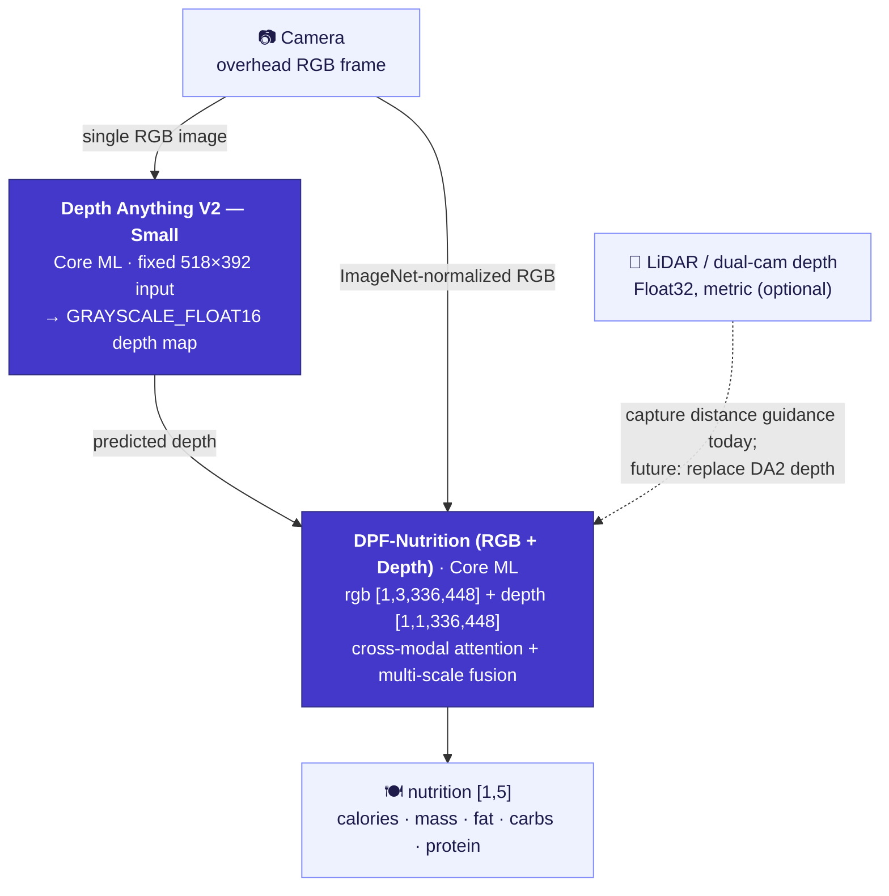

<div align="center">

[English](README.md) | [简体中文](README.zh-Hans.md) | [繁體中文](README.zh-Hant.md) | [日本語](README.ja.md) | [한국어](README.ko.md) | [Español](README.es.md) | [Português (Brasil)](README.pt-BR.md) | [Français](README.fr.md) | **Deutsch**

# CalBro — Kalorien- und Nährwert-Tracking auf dem Gerät für iOS

**Eine native SwiftUI-App für das iPhone, die Kalorien und Makronährstoffe aus einem einzigen Foto des Essens von oben schätzt – vollständig auf dem Gerät, mit einer Core-ML-Pipeline aus Depth-Anything-V2 → DPF-Nutrition.**

[](https://www.apple.com/ios/)
[](https://developer.apple.com/xcode/swiftui/)
[-5B5BD6)](https://developer.apple.com/documentation/coreml)
[](https://github.com/T0MYYY/nutrition5k-calorie-estimation)
[](https://huggingface.co/T0MYYY/dpf-nutrition)

</div>

> ⚠️ **Forschungsprototyp – kein kalibriertes Produkt.** Das Vision-Backbone wurde **nicht** gründlich für iPhone-Kameras und -Sensoren kalibriert. Die ausgegebenen Nährwerte **haben keinen Referenzwert** und dürfen nicht für medizinische, diätetische oder klinische Entscheidungen verwendet werden. Siehe [Einschränkungen](#einschränkungen).

Dies ist das **anwendungsseitige Gegenstück für das Deployment** zu unserem Forschungs-Repository [**Nutrition5k — Vision-Based Food Calorie & Nutrition Estimation**](https://github.com/T0MYYY/nutrition5k-calorie-estimation).

> **Welches Modell nutzt CalBro?** CalBro liefert das Modell **[DPF-Nutrition](https://arxiv.org/abs/2310.11702)** aus – *Depth Prediction and Fusion* (Han et al., *Foods* 2023) – und **nicht** die *Nutrition5k*-Architektur aus CVPR 2021. DPF-Nutrition ist ein Regressor nach dem Schema monokulares RGB → vorhergesagte Tiefe → RGB-D-Fusion und passt damit genau zur Aufnahme mit einem einzigen Handyfoto. Unser Forschungs-Repo reproduziert *sowohl* die Experimente aus CVPR 2021 als auch DPF-Nutrition; **CalBro setzt den DPF-Nutrition-Zweig ein.** Wir konvertieren dieses trainierte Modell nach Core ML und liefern es in einer ausgereiften iOS-App aus, die vollständig offline läuft.

---

## Screenshots

| Onboarding | Heute | Nährwerte | Statistik |
|:---:|:---:|:---:|:---:|
|  |  |  |  |
| Kalorienziel passend zum persönlichen Ziel festlegen | Tagesring, Makroringe, Mahlzeitentagebuch, Wochenleiste | Ziele, Energieverteilung, Aufschlüsselung pro Mahlzeit | Letzte 7 Tage, Trend und Makro-Durchschnitt |

| Heute (dunkel) | Scan-Ergebnis | Profil (dunkel) | Gewichtsprognose |
|:---:|:---:|:---:|:---:|
|  |  |  |  |
| Durchgängig helles und dunkles Design | Schätzung mit Portionsanpassung | Kalorienbudget, Makroziele, Wochenbericht | Zieldatum aus Ihrem Plan |

---

## Funktionen

- **Mahlzeit scannen.** Halten Sie das iPhone senkrecht über den Teller. Eine Aufnahmeführung auf dem Gerät (Neigung über CoreMotion + Abstand über LiDAR/Tiefe) zeigt an, wann Winkel und Höhe stimmen, und löst dann automatisch aus.
- **Nährwerte auf dem Gerät schätzen.** Das aufgenommene RGB-Bild und eine Tiefenkarte durchlaufen eine zweistufige Core-ML-Pipeline, die **Kalorien, Masse, Fett, Kohlenhydrate und Protein** vorhersagt – ohne Netzwerk, ohne Konto, und keine Daten verlassen das Telefon.
- **Den Tag verfolgen.** Ein Kalorienring, Makroringe, ein bearbeitbares Mahlzeitentagebuch, ein Monatskalender, Wochenstatistiken, ein Simulator für die Gewichtsprognose und ein Gewichtstrend mit Plateau-Erkennung.
- **Auf Sie kalibriert.** Nach zwei Wochen mit Wiegungen und erfassten Mahlzeiten kann CalBro die Schätzung des Erhaltungsbedarfs nach Mifflin-St Jeor durch einen Wert ersetzen, der aus Ihrer tatsächlichen Nahrungsaufnahme und Gewichtsveränderung abgeleitet ist, und aktualisiert ihn alle zwei Wochen.
- **Ins System integriert.** Health (Import von Körpermaßen und Gewichtsverlauf, gemessene aktive Energie im Tagesbudget, Sichern erfasster Mahlzeiten), Erinnerungen per lokaler Mitteilung sowie Widgets für Home- und Sperrbildschirm über WidgetKit + App Group.
- **Lokalisiert** auf Englisch, vereinfachtes und traditionelles Chinesisch, Japanisch, Koreanisch, Spanisch, brasilianisches Portugiesisch, Französisch und Deutsch, mit metrischen und imperialen Einheiten.

---

## Die ML-Pipeline auf dem Gerät



- **Stufe 1 – Tiefe.** [Depth Anything V2 Small](https://github.com/DepthAnything/Depth-Anything-V2), nach Core ML konvertiert, schätzt aus dem einzelnen RGB-Bild eine dichte Tiefenkarte (feste Eingabegröße **518×392**). Auf iPhones mit LiDAR dient der Hardware-Tiefenstream dazu, die Kamera auf die richtige Höhe zu führen; ins Modell fließt er bisher nicht ein.
- **Stufe 2 – Nährwerte.** Unser RGB-D-Regressor **DPF-Nutrition** (trainiert im [Forschungs-Repo](https://github.com/T0MYYY/nutrition5k-calorie-estimation)) verarbeitet das ImageNet-normalisierte RGB-Bild zusammen mit der Tiefenkarte und regressiert die fünf Nährwerte.
- Beide Modelle sind in der App enthalten, werden bei der ersten Nutzung kompiliert (30–60 s), als `.mlmodelc` zwischengespeichert und einmal pro App-Start geladen. Das Laden beginnt, sobald sich die Kamera öffnet.

Implementierung: `CalBro/Services/NutritionPredictionService.swift`, `ImagePreprocessing.swift`, `CameraCaptureController.swift`.

---

## Architektur

- **SwiftUI + `@Observable`-MVVM**, iOS 27, strikte Concurrency-Prüfung von Swift 6, Oberfläche mit drei Tabs (Heute / Statistik / Profil). Die Kamera ist ein Vollbild-Modal, das über die Taste **+** in Heute geöffnet wird.
- **Single Source of Truth**: `ProfileStore` (Profil + Gewichtsverlauf) und `MealLogStore` (Mahlzeiten + Tagessummen) werden von jedem Screen direkt beobachtet, sodass eine Änderung sofort überall sichtbar ist.
- **Aufnahmeführung** (`CameraCaptureController`, `CameraFlowViewModel`): wählt `.builtInLiDARDepthCamera` für echte Tiefe und gibt die automatische Auslösung nur bei Draufsicht (Neigung < 28°) **und** einer Höhe im Bereich von **27–34 cm** frei, dargestellt als einheitenlose Abstandsleiste. Der manuelle Auslöser ist jederzeit verfügbar.
- **Persistenz**: Mahlzeiten (≈13 Monate), Profil, Gewichtsverlauf und Einstellungen in `UserDefaults`; der Stand des aktuellen Tages wird für das Widget in eine **App Group** (`group.com.wydfcc.calbro`) gespiegelt.
- **WidgetKit** (`CalBroWidget/`): Widgets für den Home-Bildschirm (klein/mittel) und den Sperrbildschirm (rund/rechteckig). Dieselbe View (`Shared/NutritionWidgetFace.swift`) rendert auch die Vorschau in der App. Timelines werden bei jeder Änderung neu geladen und wechseln um Mitternacht auf den neuen Tag.
- **HealthKit** (`HealthKitService`, `IntegrationViewModel`): Jeder Teil ist optional – Körpermaße + Gewichtsverlauf, aktive Energie (ersetzt im heutigen Budget den Zuschlag über den Aktivitätsfaktor) sowie das Schreiben von Energie und Makros der Mahlzeiten mit Sync-Identifiern, damit Bearbeitungen und Löschungen synchron bleiben.
- **Lokale Mitteilungen**: eine Mahlzeiten-Erinnerung zur gewählten Uhrzeit, die an Tagen mit bereits erfassten Mahlzeiten entfällt, sowie eine einmal tägliche Warnung bei 90 % des Ziels.
- **Lokalisierung**: String Catalogs (`Localizable.xcstrings`, `InfoPlist.xcstrings`), die App und Widget gemeinsam nutzen; Datums-, Zahlen- und Einheitenangaben laufen über die Formatter des Systems.
- **Einheiten**: Größe und Gewicht metrisch oder imperial (Onboarding und Profil); Kalorien immer in kcal.

```
CalBro/
├── Models/            UserProfile, LoggedMeal, nutrition & camera models
├── ViewModels/        Dashboard, CameraFlow, Calendar, Goals, Integration, …
├── Services/          CoreML pipeline, camera, HealthKit, reminders, meal store
├── Shared/            SharedNutrition.swift (App Group bridge, app + widget)
├── Views/             Today, Camera, Calendar, Stats, Goals, Integrations, …
├── DesignSystem/      CBColors / CBTypography / CBGlass / CBComponents
└── Resources/Models/  bundled Core ML packages (DA2 + DPF)
CalBroWidget/          WidgetKit extension
```

---

## Bauen und ausführen

1. Legen Sie die Core-ML-Modelle (nicht in Git – zu groß) in `CalBro/Resources/Models/` ab – siehe [`MODELS.md`](CalBro/Resources/Models/MODELS.md). Ohne sie meldet die Kamera, dass das Modell nicht installiert ist.
2. Das Xcode-Projekt wird mit [XcodeGen](https://github.com/yonaskolb/XcodeGen) aus `project.yml` generiert (`xcodegen generate`); das generierte Projekt ist ebenfalls eingecheckt.
3. Öffnen Sie `CalBro.xcodeproj` in **Xcode 27+** und wählen Sie das Scheme **CalBro**.
4. Führen Sie die App auf einem Gerät mit iOS 27 aus (für die Tiefe wird ein iPhone Pro mit LiDAR empfohlen).

```bash
# Simulator build
xcodebuild -project CalBro.xcodeproj -scheme CalBro \
  -destination 'platform=iOS Simulator,name=iPhone 18 Pro' -configuration Debug build

# Device build (automatic signing registers App Group + HealthKit + widget)
xcodebuild -project CalBro.xcodeproj -scheme CalBro \
  -destination 'generic/platform=iOS' -configuration Debug -allowProvisioningUpdates build
```

```bash
# Unit tests
xcodebuild -project CalBro.xcodeproj -scheme CalBro \
  -destination 'platform=iOS Simulator,name=iPhone 18 Pro' test
```

Verwendete Capabilities: **App Groups**, **HealthKit**, **Camera**, **User Notifications**, **WidgetKit**.

---

## Einschränkungen

**Diese App ist ein studentisches Projekt, und ihre Nährwertangaben sind nicht vertrauenswürdig.** Die Einschränkungen, ehrlich benannt:

- **Das Backbone ist nicht gründlich kalibriert.** Das Vision-Modell wurde weder auf die intrinsischen Parameter von iPhone-Kameras noch anhand realer Ground-Truth-Daten angerichteter Speisen auf dem Gerät kalibriert. **Die ausgegebenen Zahlen haben keinen Referenzwert** – betrachten Sie sie als UI- und Architektur-Demo, nicht als Messwerte.
- **Wegen Datenmangels ist eine Kalibrierung hier nicht machbar.** Ein Tiefen-/Nährwertmodell für die Handyaufnahme zu kalibrieren erfordert einen großen, gerätespezifischen Datensatz mit gewogener Ground Truth. Wer **ein ganzes Jahr lang 4 Mahlzeiten pro Tag** erfasst, kommt auf nur **~1.460 Fotos** – bei Weitem nicht genug, um eine Pipeline aus Sensor + Modell zu kalibrieren, und dabei ist noch nicht berücksichtigt, dass **jedes iPhone-Modell (Objektiv, LiDAR, ISP) vermutlich eine eigene Anpassung bräuchte.**
- **Monokulare Tiefe ist nur ein Näherungswert.** Depth Anything V2 schätzt aus einem einzigen RGB-Bild die relative Tiefe; sie ist nicht metrisch und nicht auf die Geometrie von Speisen und Portionen abgestimmt.
- **Keine Lebensmitteldatenbank, keine Portions-Priors.** Es gibt weder ein Backend noch eine Datenbank zur Lebensmittelerkennung oder eine Aufschlüsselung nach Zutaten – nur die fünf Werte des End-to-End-Regressors.

> **Verwenden Sie CalBro nicht für medizinische, diätetische oder klinische Entscheidungen.** Es handelt sich um einen Forschungs- und Engineering-Prototyp.

---

## Ausblick

- **Die LiDAR-Tiefe des iPhones direkt nutzen.** Das Hardware-Tiefenbild (`kCVPixelFormatType_DepthFloat32`, metrisch, in Metern) hat großes Potenzial, **die monokulare Depth-Anything-Stufe vollständig zu ersetzen** – die App streamt es bereits für die Abstandsführung. Was fehlt, ist die **Datenerhebung**, um DPF auf echter LiDAR-Tiefe neu zu trainieren bzw. zu kalibrieren; im Rahmen dieses Projekts ist das nicht machbar.
- **CLIP-/VLM-Fusion.** Ein Bild-Text-Modell im Stil von CLIP (Priors für Lebensmittelkategorien, Open-Vocabulary-Erkennung) mit dem RGB-D-Regressor zu fusionieren, ist ein vielversprechender Ansatz – sowohl für die Genauigkeit als auch für Aufschlüsselungen nach Zutaten.
- **Kalibrierung pro Gerät und ein echter Ground-Truth-Datensatz** (gewogene Mahlzeiten über verschiedene iPhone-Modelle hinweg).
- Benennung von Gerichten (das Modell sagt Nährwerte vorher, nicht, um welches Gericht es sich handelt) und Live Activities.

---

## Bezug zum Forschungs-Repo

CalBro ist der Deployment-Zweig von **[T0MYYY/nutrition5k-calorie-estimation](https://github.com/T0MYYY/nutrition5k-calorie-estimation)** – dort werden die Modelle trainiert und das Paper aus CVPR 2021 reproduziert. Methodik, Metriken und die Live-Web-Demo finden Sie in diesem Repo.

## Zitation

CalBro setzt das Modell **DPF-Nutrition** ein. Wenn Sie diese Arbeit verwenden, zitieren Sie bitte das Originalpaper:

```bibtex
@article{han2023dpfnutrition,
  title   = {DPF-Nutrition: Food Nutrition Estimation via Depth Prediction and Fusion},
  author  = {Han, Yuzhe and Cheng, Qimin and Wu, Wenjin and Huang, Ziyang},
  journal = {Foods},
  volume  = {12},
  number  = {23},
  pages   = {4293},
  year    = {2023},
  doi     = {10.3390/foods12234293}
}
```

Der Datensatz und der ursprüngliche Benchmark:

```bibtex
@inproceedings{thames2021nutrition5k,
  title     = {Nutrition5k: Towards Automatic Nutritional Understanding of Generic Food},
  author    = {Thames, Quin and Karpur, Arjun and Norris, Wade and Xia, Fangting and Panait, Liviu and Weyand, Tobias and Sim, Jack},
  booktitle = {CVPR},
  year      = {2021}
}
```

Tiefen-Backbone: [Depth Anything V2](https://github.com/DepthAnything/Depth-Anything-V2) (Yang et al., 2024).

## Lizenz / Haftungsausschluss

Lizenziert unter der [MIT-Lizenz](LICENSE).

Forschungs- und Lehrprototyp. Die Nährwertangaben sind **nicht** validiert und dürfen nicht als Grundlage für Gesundheitsentscheidungen dienen.
