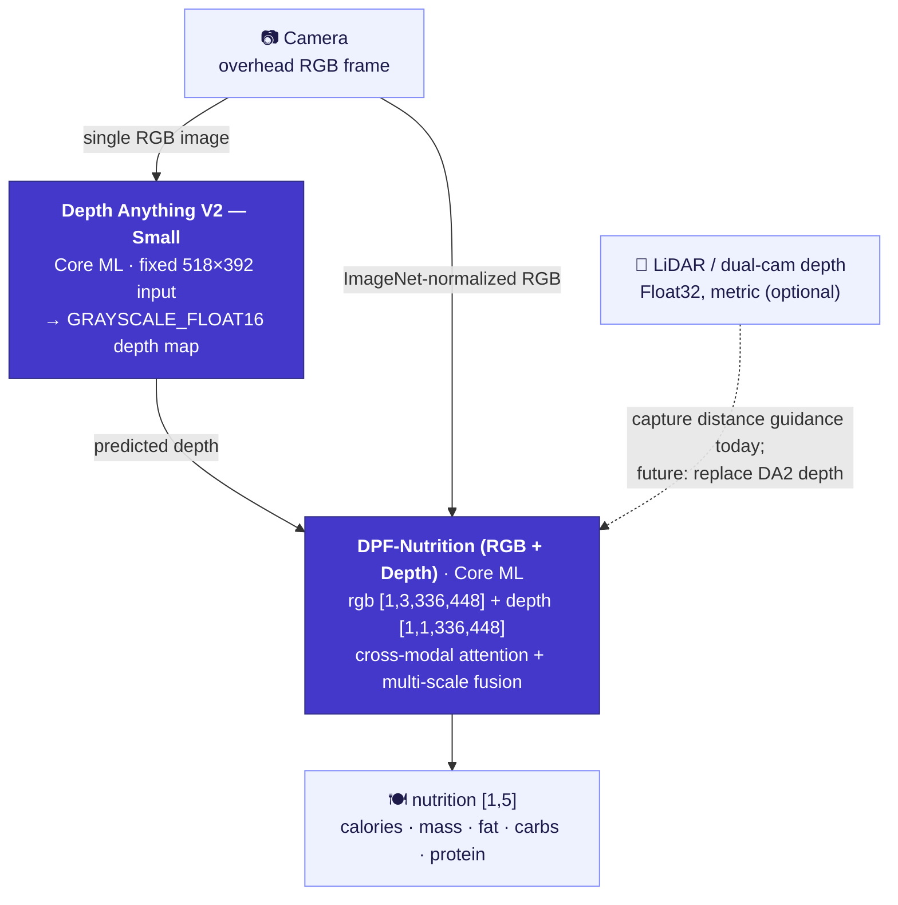

<div align="center">

[English](README.md) | [简体中文](README.zh-Hans.md) | [繁體中文](README.zh-Hant.md) | [日本語](README.ja.md) | [한국어](README.ko.md) | **Español** | [Português (Brasil)](README.pt-BR.md) | [Français](README.fr.md) | [Deutsch](README.de.md)

# CalBro — Seguimiento de calorías y nutrición en el dispositivo para iOS

**Una app nativa de SwiftUI para iPhone que estima las calorías y los macronutrientes a partir de una sola foto cenital del plato, íntegramente en el dispositivo, con un pipeline de Core ML Depth-Anything-V2 → DPF-Nutrition.**

[](https://www.apple.com/ios/)
[](https://developer.apple.com/xcode/swiftui/)
[-5B5BD6)](https://developer.apple.com/documentation/coreml)
[](https://github.com/T0MYYY/nutrition5k-calorie-estimation)
[](https://huggingface.co/T0MYYY/dpf-nutrition)

</div>

> ⚠️ **Prototipo de investigación, no un producto calibrado.** El backbone de visión **no** se ha calibrado rigurosamente para las cámaras y sensores del iPhone. Los valores nutricionales que produce **no tienen valor de referencia** y no deben usarse para tomar decisiones médicas, dietéticas ni clínicas. Consulta [Limitaciones](#limitaciones).

Este es el **complemento aplicado / de despliegue** de nuestro repositorio de investigación [**Nutrition5k — Vision-Based Food Calorie & Nutrition Estimation**](https://github.com/T0MYYY/nutrition5k-calorie-estimation).

> **¿Qué modelo usa CalBro?** CalBro incluye el modelo **[DPF-Nutrition](https://arxiv.org/abs/2310.11702)** — *Depth Prediction and Fusion* (Han et al., *Foods* 2023) — y **no** la arquitectura *Nutrition5k* de CVPR 2021. DPF-Nutrition es un regresor monocular RGB → profundidad predicha → fusión RGB-D, justo lo que encaja con una captura de una sola foto desde el móvil. Nuestro repositorio de investigación reproduce *tanto* los experimentos de CVPR 2021 como DPF-Nutrition; **CalBro despliega la línea DPF-Nutrition.** Convertimos ese modelo entrenado a Core ML y lo integramos en una app de iOS pulida que funciona totalmente sin conexión.

---

## Capturas de pantalla

| Configuración inicial | Hoy | Nutrición | Estadísticas |
|:---:|:---:|:---:|:---:|
|  |  |  |  |
| Meta calórica definida según tu objetivo | Anillo diario, anillos de macros, registro de comidas, tira semanal | Metas, reparto energético, desglose por comida | Últimos 7 días, tendencia y promedios de macros |

| Hoy (oscuro) | Resultado del escaneo | Perfil (oscuro) | Predicción de peso |
|:---:|:---:|:---:|:---:|
|  |  |  |  |
| Tema claro/oscuro completo | Estimación con ajuste de ración (se muestra el ejemplo del simulador) | Presupuesto calórico, metas de macros, resumen semanal | Fecha objetivo según tu plan |

---

## Qué hace

- **Escanea una comida.** Apunta el móvil en vertical hacia el plato. Un sistema de guiado en el dispositivo (inclinación con CoreMotion + distancia con LiDAR/profundidad) te indica cuándo el ángulo y la altura son correctos y captura automáticamente.
- **Estima la nutrición en el dispositivo.** El fotograma RGB capturado y un mapa de profundidad pasan por un pipeline de Core ML en dos etapas que predice **calorías, masa, grasa, carbohidratos y proteína**, sin red, sin cuenta y sin que ningún dato salga del teléfono.
- **Sigue tu día.** Anillo de calorías, anillos de macros, registro de comidas editable, calendario mensual, estadísticas semanales, un simulador de predicción de peso y una tendencia de peso con detección de estancamiento.
- **Se calibra para ti.** Tras dos semanas de pesajes y registros de comidas, CalBro puede sustituir la estimación de mantenimiento de Mifflin-St Jeor por una calculada a partir de tu propia ingesta y de tu cambio de peso, y la actualiza cada dos semanas.
- **Se integra con el sistema.** Salud (importa medidas corporales e historial de peso, usa la energía activa medida en el presupuesto diario y guarda las comidas registradas), recordatorios mediante notificaciones locales y widgets para la pantalla de inicio y de bloqueo con WidgetKit + App Group.
- **Localizada** en inglés, chino simplificado y tradicional, japonés, coreano, español, portugués de Brasil, francés y alemán, con unidades métricas e imperiales.

---

## El pipeline de ML en el dispositivo



- **Etapa 1 — Profundidad.** [Depth Anything V2 Small](https://github.com/DepthAnything/Depth-Anything-V2), convertido a Core ML, estima un mapa de profundidad denso a partir del único fotograma RGB (entrada fija de **518×392**). En los iPhone con LiDAR, el flujo de profundidad del hardware se usa para guiar la cámara a la altura correcta; todavía no se pasa al modelo.
- **Etapa 2 — Nutrición.** Nuestro regresor RGB-D **DPF-Nutrition** (entrenado en el [repositorio de investigación](https://github.com/T0MYYY/nutrition5k-calorie-estimation)) recibe el RGB normalizado con ImageNet + el mapa de profundidad y estima por regresión los cinco valores nutricionales.
- Ambos modelos van incluidos en la app, se compilan en el primer uso (30–60 s), se guardan en caché como `.mlmodelc` y se cargan una vez por arranque. La carga empieza al abrir la cámara.

Implementación: `CalBro/Services/NutritionPredictionService.swift`, `ImagePreprocessing.swift`, `CameraCaptureController.swift`.

---

## Arquitectura

- **SwiftUI + MVVM con `@Observable`**, iOS 26, concurrencia estricta de Swift 6 y una estructura de tres pestañas (Hoy / Estadísticas / Perfil). La cámara es un modal a pantalla completa que se abre con el botón **+** de Hoy.
- **Fuente única de verdad**: `ProfileStore` (perfil + registro de peso) y `MealLogStore` (comidas + totales por día) se observan directamente desde todas las pantallas, así que cualquier cambio aparece al instante en todas partes.
- **Guiado de captura** (`CameraCaptureController`, `CameraFlowViewModel`): selecciona `.builtInLiDARDepthCamera` para obtener profundidad real y solo permite la captura automática con inclinación cenital (< 28°) **y** una altura de **27–34 cm**, mostrada como una barra de distancia sin unidades. El disparador manual siempre está disponible.
- **Persistencia**: comidas (≈13 meses), perfil, registro de peso y ajustes en `UserDefaults`; la instantánea del día se replica en un **App Group** (`group.com.wydfcc.calbro`) para el widget.
- **WidgetKit** (`CalBroWidget/`): widgets para la pantalla de inicio (pequeño/mediano) y la pantalla de bloqueo (circular/rectangular). La misma vista (`Shared/NutritionWidgetFace.swift`) genera la vista previa dentro de la app. Las líneas de tiempo se recargan con cada cambio y se renuevan a medianoche.
- **HealthKit** (`HealthKitService`, `IntegrationViewModel`): cada parte es opcional — medidas corporales + historial de peso, energía activa (sustituye el margen del multiplicador de actividad en el presupuesto del día) y escritura de energía/macros de las comidas con identificadores de sincronización para que las ediciones y los borrados se mantengan al día.
- **Notificaciones locales**: un recordatorio de comida a la hora elegida que se omite los días en que ya has registrado algo, y un aviso diario al llegar al 90 % de la meta.
- **Localización**: String Catalogs (`Localizable.xcstrings`, `InfoPlist.xcstrings`) compartidos por la app y el widget; fechas, números y unidades usan los formateadores del sistema.
- **Unidades**: altura y peso en sistema métrico o imperial (configuración inicial y perfil); las calorías siempre se muestran en kcal.

```
CalBro/
├── Models/            UserProfile, LoggedMeal, nutrition & camera models
├── ViewModels/        Dashboard, CameraFlow, Calendar, Goals, Integration, …
├── Services/          CoreML pipeline, camera, HealthKit, reminders, meal store
├── Shared/            SharedNutrition.swift (App Group bridge, app + widget)
├── Views/             Today, Camera, Calendar, Stats, Goals, Integrations, …
├── DesignSystem/      CBColors / CBTypography / CBGlass / CBComponents
└── Resources/Models/  bundled Core ML packages (DA2 + DPF)
CalBroWidget/          WidgetKit extension
```

---

## Compilar y ejecutar

1. Coloca los modelos de Core ML (no están en git, son demasiado grandes) en `CalBro/Resources/Models/`; consulta [`MODELS.md`](CalBro/Resources/Models/MODELS.md). Sin ellos, la cámara indica que el modelo no está instalado.
2. El proyecto de Xcode se genera a partir de `project.yml` con [XcodeGen](https://github.com/yonaskolb/XcodeGen) (`xcodegen generate`); el proyecto generado también está en el repositorio.
3. Abre `CalBro.xcodeproj` en **Xcode 26+** y selecciona el esquema **CalBro**.
4. Ejecútalo en un dispositivo con iOS 26 (se recomienda un iPhone Pro con LiDAR para la profundidad).

```bash
# Simulator build
xcodebuild -project CalBro.xcodeproj -scheme CalBro \
  -destination 'platform=iOS Simulator,name=iPhone 17 Pro' -configuration Debug build

# Device build (automatic signing registers App Group + HealthKit + widget)
xcodebuild -project CalBro.xcodeproj -scheme CalBro \
  -destination 'generic/platform=iOS' -configuration Debug -allowProvisioningUpdates build
```

```bash
# Unit tests
xcodebuild -project CalBro.xcodeproj -scheme CalBro \
  -destination 'platform=iOS Simulator,name=iPhone 17 Pro' test
```

Capacidades utilizadas: **App Groups**, **HealthKit**, **Cámara**, **Notificaciones de usuario**, **WidgetKit**.

---

## Limitaciones

**Esta app es un proyecto de estudiante y sus resultados nutricionales no son fiables.** Las limitaciones, sin rodeos:

- **El backbone no está calibrado rigurosamente.** El modelo de visión no se ha calibrado con los parámetros intrínsecos de la cámara del iPhone ni con datos reales de platos servidos medidos en el dispositivo. **Los valores que produce no tienen valor de referencia**: trátalos como una demostración de interfaz y arquitectura, no como mediciones.
- **La escasez de datos hace inviable la calibración aquí.** Calibrar un modelo de profundidad/nutrición para capturas con el móvil requiere un conjunto de datos grande, específico del dispositivo y con referencias pesadas. Registrar **4 comidas al día durante un año entero** da solo **~1.460 fotos**, muy lejos de lo necesario para calibrar un pipeline de sensor + modelo, y eso sin contar que **cada modelo de iPhone (lente, LiDAR, ISP) probablemente necesitaría su propia adaptación.**
- **La profundidad monocular es una aproximación.** Depth Anything V2 estima la profundidad relativa a partir de un único fotograma RGB; no es métrica y no está ajustada a la geometría de los alimentos ni de las raciones.
- **Sin base de datos de alimentos ni referencias de ración.** No hay backend, base de datos de reconocimiento de alimentos ni desglose por ingrediente: solo los cinco valores del regresor de extremo a extremo.

> **No uses CalBro para tomar decisiones médicas, dietéticas ni clínicas.** Es un prototipo de investigación e ingeniería.

---

## Trabajo futuro

- **Usar directamente la profundidad LiDAR del iPhone.** El fotograma de profundidad del hardware (`kCVPixelFormatType_DepthFloat32`, métrico, en metros) tiene un gran potencial para **sustituir por completo la etapa monocular de Depth-Anything**; la app ya lo recibe para el guiado de distancia. Lo que falta es la **recogida de datos** para reentrenar/calibrar DPF con profundidad LiDAR real, algo inviable en este proyecto.
- **Fusión con CLIP / VLM.** Combinar un modelo imagen-texto de tipo CLIP (referencias por categoría de alimento, reconocimiento de vocabulario abierto) con el regresor RGB-D es una línea prometedora tanto para la precisión como para el desglose por ingrediente.
- **Calibración por dispositivo y un conjunto de datos de referencia real** (comidas pesadas con distintos modelos de iPhone).
- Identificación del plato (el modelo predice nutrientes, no qué plato es) y Live Activities.

---

## Relación con el repositorio de investigación

CalBro es la línea de despliegue de **[T0MYYY/nutrition5k-calorie-estimation](https://github.com/T0MYYY/nutrition5k-calorie-estimation)**, donde se entrenan los modelos y se reproduce el artículo de CVPR 2021. Consulta ese repositorio para ver la metodología, las métricas y la demo web en vivo.

## Citas

CalBro despliega el modelo **DPF-Nutrition**. Si usas este trabajo, cita el artículo original:

```bibtex
@article{han2023dpfnutrition,
  title   = {DPF-Nutrition: Food Nutrition Estimation via Depth Prediction and Fusion},
  author  = {Han, Yuzhe and Cheng, Qimin and Wu, Wenjin and Huang, Ziyang},
  journal = {Foods},
  volume  = {12},
  number  = {23},
  pages   = {4293},
  year    = {2023},
  doi     = {10.3390/foods12234293}
}
```

El conjunto de datos y el benchmark original:

```bibtex
@inproceedings{thames2021nutrition5k,
  title     = {Nutrition5k: Towards Automatic Nutritional Understanding of Generic Food},
  author    = {Thames, Quin and Karpur, Arjun and Norris, Wade and Xia, Fangting and Panait, Liviu and Weyand, Tobias and Sim, Jack},
  booktitle = {CVPR},
  year      = {2021}
}
```

Backbone de profundidad: [Depth Anything V2](https://github.com/DepthAnything/Depth-Anything-V2) (Yang et al., 2024).

## Licencia / aviso legal

Publicado bajo la [licencia MIT](LICENSE).

Prototipo de investigación y educativo. Los resultados nutricionales **no** están validados y no deben orientar decisiones de salud.
