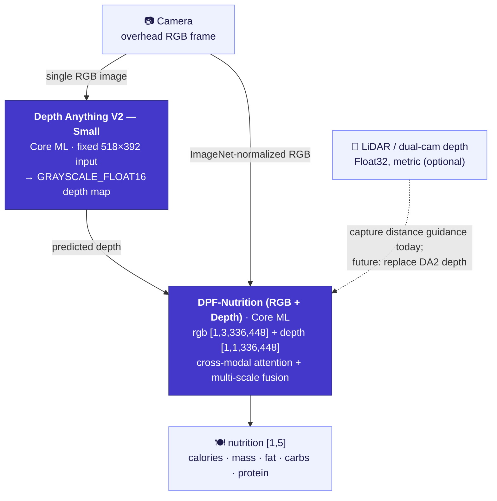

<div align="center">

[English](README.md) | [简体中文](README.zh-Hans.md) | [繁體中文](README.zh-Hant.md) | [日本語](README.ja.md) | [한국어](README.ko.md) | [Español](README.es.md) | [Português (Brasil)](README.pt-BR.md) | **Français** | [Deutsch](README.de.md)

# CalBro — Suivi des calories et des nutriments sur l'appareil pour iOS

**Une app iPhone native en SwiftUI qui estime les calories et les macronutriments à partir d'une seule photo du plat prise à la verticale, entièrement sur l'appareil, grâce à un pipeline Core ML Depth-Anything-V2 → DPF-Nutrition.**

[](https://www.apple.com/ios/)
[](https://developer.apple.com/xcode/swiftui/)
[-5B5BD6)](https://developer.apple.com/documentation/coreml)
[](https://github.com/T0MYYY/nutrition5k-calorie-estimation)
[](https://huggingface.co/T0MYYY/dpf-nutrition)

</div>

> ⚠️ **Prototype de recherche — pas un produit calibré.** Le backbone de vision n'a **pas** été rigoureusement calibré pour les caméras et capteurs de l'iPhone. Les valeurs nutritionnelles qu'il produit **n'ont aucune valeur de référence** et ne doivent pas servir à des décisions médicales, diététiques ou cliniques. Voir [Limites](#limites).

Ce dépôt est le **pendant appliqué / déploiement** de notre dépôt de recherche [**Nutrition5k — Vision-Based Food Calorie & Nutrition Estimation**](https://github.com/T0MYYY/nutrition5k-calorie-estimation).

> **Quel modèle CalBro utilise-t-il ?** CalBro embarque le modèle **[DPF-Nutrition](https://arxiv.org/abs/2310.11702)** — *Depth Prediction and Fusion* (Han et al., *Foods* 2023) — et **non** l'architecture *Nutrition5k* du CVPR 2021. DPF-Nutrition est un régresseur RGB monoculaire → profondeur prédite → fusion RGB-D, exactement ce qui convient à une capture sur téléphone à partir d'une seule photo. Notre dépôt de recherche reproduit *à la fois* les expériences du CVPR 2021 et DPF-Nutrition ; **CalBro déploie la piste DPF-Nutrition.** Nous convertissons ce modèle entraîné en Core ML et l'intégrons à une app iOS soignée qui fonctionne entièrement hors ligne.

---

## Captures d'écran

| Prise en main | Aujourd'hui | Nutrition | Stats |
|:---:|:---:|:---:|:---:|
|  |  |  |  |
| Objectif calorique défini à partir de votre but | Anneau quotidien, anneaux de macros, journal des repas, bandeau de la semaine | Objectifs, répartition de l'énergie, détail par repas | 7 derniers jours, tendance et moyennes des macros |

| Aujourd'hui (sombre) | Résultat du scan | Profil (sombre) | Prévision de poids |
|:---:|:---:|:---:|:---:|
|  |  |  |  |
| Thème clair/sombre complet | Estimation avec ajustement de la portion (exemple du simulateur) | Budget calorique, objectifs macros, bilan hebdomadaire | Date cible d'après votre plan |

---

## Ce que fait l'app

- **Scanner un repas.** Tenez le téléphone à la verticale au-dessus de l'assiette. Un système de guidage sur l'appareil (inclinaison via CoreMotion + distance via LiDAR/profondeur) vous indique quand l'angle et la hauteur sont bons, puis déclenche la capture automatiquement.
- **Estimer la nutrition sur l'appareil.** L'image RGB capturée et une carte de profondeur passent par un pipeline Core ML en deux étapes qui prédit **calories, masse, lipides, glucides et protéines** — sans réseau, sans compte, et aucune donnée ne quitte le téléphone.
- **Suivre la journée.** Un anneau de calories, des anneaux de macros, un journal des repas modifiable, un calendrier mensuel, des statistiques hebdomadaires, un simulateur de prévision de poids et une tendance du poids avec détection de plateau.
- **Se calibrer sur vous.** Après deux semaines de pesées et de repas notés, CalBro peut remplacer l'estimation du maintien selon Mifflin-St Jeor par une valeur tirée de vos propres apports et de l'évolution de votre poids, puis l'actualise toutes les deux semaines.
- **S'intégrer au système.** Santé (import des mensurations et de l'historique de poids, prise en compte de l'énergie active mesurée dans le budget du jour, enregistrement des repas notés), rappels par notifications locales et widgets pour l'écran d'accueil et l'écran verrouillé via WidgetKit + App Group.
- **Localisée** en anglais, chinois simplifié et traditionnel, japonais, coréen, espagnol, portugais du Brésil, français et allemand, avec unités métriques et impériales.

---

## Le pipeline ML sur l'appareil



- **Étape 1 — Profondeur.** [Depth Anything V2 Small](https://github.com/DepthAnything/Depth-Anything-V2), converti en Core ML, estime une carte de profondeur dense à partir de l'image RGB unique (entrée fixe **518×392**). Sur les iPhone équipés du LiDAR, le flux de profondeur matériel sert à guider l'appareil photo jusqu'à la bonne hauteur ; il n'est pas encore transmis au modèle.
- **Étape 2 — Nutrition.** Notre régresseur RGB-D **DPF-Nutrition** (entraîné dans le [dépôt de recherche](https://github.com/T0MYYY/nutrition5k-calorie-estimation)) prend en entrée le RGB normalisé ImageNet et la carte de profondeur, puis régresse les cinq valeurs nutritionnelles.
- Les deux modèles sont intégrés à l'app, compilés à la première utilisation (30–60 s), mis en cache au format `.mlmodelc` et chargés une fois par lancement. Le chargement démarre dès l'ouverture de l'appareil photo.

Implémentation : `CalBro/Services/NutritionPredictionService.swift`, `ImagePreprocessing.swift`, `CameraCaptureController.swift`.

---

## Architecture

- **SwiftUI + MVVM avec `@Observable`**, iOS 26, concurrence stricte de Swift 6, structure à trois onglets (Aujourd'hui / Stats / Profil). L'appareil photo est une vue modale plein écran ouverte depuis le bouton **+** d'Aujourd'hui.
- **Source unique de vérité** : `ProfileStore` (profil + historique de poids) et `MealLogStore` (repas + totaux par jour) sont observés directement par chaque écran, si bien qu'une modification apparaît immédiatement partout.
- **Guidage de capture** (`CameraCaptureController`, `CameraFlowViewModel`) : sélectionne `.builtInLiDARDepthCamera` pour obtenir une vraie profondeur et ne déclenche la capture automatique qu'avec une inclinaison proche de la verticale (< 28°) **et** une hauteur comprise dans la plage de **27–34 cm**, affichée sous forme de barre de distance sans unité. Le déclencheur manuel reste toujours disponible.
- **Persistance** : repas (≈13 mois), profil, historique de poids et réglages dans `UserDefaults` ; l'instantané du jour est dupliqué dans un **App Group** (`group.com.wydfcc.calbro`) pour le widget.
- **WidgetKit** (`CalBroWidget/`) : widgets pour l'écran d'accueil (petit/moyen) et l'écran verrouillé (circulaire/rectangulaire). La même vue (`Shared/NutritionWidgetFace.swift`) sert à l'aperçu dans l'app. Les timelines sont rechargées à chaque modification et passent au jour suivant à minuit.
- **HealthKit** (`HealthKitService`, `IntegrationViewModel`) : chaque volet est facultatif — mensurations + historique de poids, énergie active (remplace la marge liée au coefficient d'activité dans le budget du jour), et écriture de l'énergie et des macros des repas avec des identifiants de synchronisation, pour que modifications et suppressions restent alignées.
- **Notifications locales** : un rappel de repas à l'heure choisie, ignoré les jours où vous avez déjà noté un repas, et une alerte unique par jour à 90 % de l'objectif.
- **Localisation** : String Catalogs (`Localizable.xcstrings`, `InfoPlist.xcstrings`) partagés entre l'app et le widget ; dates, nombres et unités passent par les formateurs du système.
- **Unités** : taille et poids en métrique ou impérial (prise en main et profil) ; les calories sont toujours exprimées en kcal.

```
CalBro/
├── Models/            UserProfile, LoggedMeal, nutrition & camera models
├── ViewModels/        Dashboard, CameraFlow, Calendar, Goals, Integration, …
├── Services/          CoreML pipeline, camera, HealthKit, reminders, meal store
├── Shared/            SharedNutrition.swift (App Group bridge, app + widget)
├── Views/             Today, Camera, Calendar, Stats, Goals, Integrations, …
├── DesignSystem/      CBColors / CBTypography / CBGlass / CBComponents
└── Resources/Models/  bundled Core ML packages (DA2 + DPF)
CalBroWidget/          WidgetKit extension
```

---

## Compilation et exécution

1. Placez les modèles Core ML (absents de git — trop volumineux) dans `CalBro/Resources/Models/` — voir [`MODELS.md`](CalBro/Resources/Models/MODELS.md). Sans eux, l'appareil photo indique que le modèle n'est pas installé.
2. Le projet Xcode est généré à partir de `project.yml` avec [XcodeGen](https://github.com/yonaskolb/XcodeGen) (`xcodegen generate`) ; le projet généré est lui aussi versionné.
3. Ouvrez `CalBro.xcodeproj` dans **Xcode 26+** et sélectionnez le scheme **CalBro**.
4. Lancez l'app sur un appareil sous iOS 26 (iPhone Pro avec LiDAR recommandé pour la profondeur).

```bash
# Simulator build
xcodebuild -project CalBro.xcodeproj -scheme CalBro \
  -destination 'platform=iOS Simulator,name=iPhone 17 Pro' -configuration Debug build

# Device build (automatic signing registers App Group + HealthKit + widget)
xcodebuild -project CalBro.xcodeproj -scheme CalBro \
  -destination 'generic/platform=iOS' -configuration Debug -allowProvisioningUpdates build
```

```bash
# Unit tests
xcodebuild -project CalBro.xcodeproj -scheme CalBro \
  -destination 'platform=iOS Simulator,name=iPhone 17 Pro' test
```

Capacités utilisées : **App Groups**, **HealthKit**, **Camera**, **User Notifications**, **WidgetKit**.

---

## Limites

**Cette app est un projet étudiant, et ses résultats nutritionnels ne sont pas fiables.** Les contraintes, en toute honnêteté :

- **Le backbone n'est pas rigoureusement calibré.** Le modèle de vision n'a été calibré ni sur les paramètres intrinsèques des caméras d'iPhone, ni sur des données de référence réelles d'assiettes mesurées sur l'appareil. **Les chiffres qu'il produit n'ont aucune valeur de référence** — considérez-les comme une démo d'interface et d'architecture, pas comme des mesures.
- **Le manque de données rend le calibrage impossible ici.** Calibrer un modèle de profondeur/nutrition pour la capture sur téléphone exige un vaste jeu de données propre à chaque appareil, avec des repas pesés comme vérité terrain. Noter **4 repas par jour pendant une année entière** ne donne que **~1 460 photos** — très loin de ce qu'il faut pour calibrer un pipeline capteur + modèle, et c'est sans compter que **chaque modèle d'iPhone (objectif, LiDAR, ISP) nécessiterait probablement sa propre adaptation.**
- **La profondeur monoculaire n'est qu'une approximation.** Depth Anything V2 estime une profondeur relative à partir d'une seule image RGB ; elle n'est pas métrique et n'est pas adaptée à la géométrie des aliments et des portions.
- **Aucune base d'aliments ni a priori sur les portions.** Il n'y a ni backend, ni base de reconnaissance des aliments, ni détail par ingrédient — uniquement les cinq valeurs du régresseur de bout en bout.

> **N'utilisez pas CalBro pour des décisions médicales, diététiques ou cliniques.** C'est un prototype de recherche et d'ingénierie.

---

## Pistes futures

- **Utiliser directement la profondeur LiDAR de l'iPhone.** L'image de profondeur matérielle (`kCVPixelFormatType_DepthFloat32`, métrique, en mètres) pourrait bien **remplacer entièrement l'étape monoculaire Depth-Anything** — l'app la reçoit déjà en continu pour le guidage de distance. Ce qui manque, c'est la **collecte de données** nécessaire pour réentraîner/calibrer DPF sur une vraie profondeur LiDAR, ce qui n'est pas réalisable dans le cadre de ce projet.
- **Fusion CLIP / VLM.** Fusionner un modèle image-texte de type CLIP (a priori sur les catégories d'aliments, reconnaissance en vocabulaire ouvert) avec le régresseur RGB-D est une piste prometteuse, tant pour la précision que pour le détail par ingrédient.
- **Calibrage par appareil et véritable jeu de données de référence** (repas pesés sur différents modèles d'iPhone).
- Reconnaissance du nom des plats (le modèle prédit les nutriments, pas la nature du plat) et Live Activities.

---

## Lien avec le dépôt de recherche

CalBro est la piste de déploiement de **[T0MYYY/nutrition5k-calorie-estimation](https://github.com/T0MYYY/nutrition5k-calorie-estimation)** — c'est là que les modèles sont entraînés et que l'article du CVPR 2021 est reproduit. Consultez ce dépôt pour la méthodologie, les métriques et la démo web en ligne.

## Citations

CalBro déploie le modèle **DPF-Nutrition**. Si vous utilisez ce travail, merci de citer l'article original :

```bibtex
@article{han2023dpfnutrition,
  title   = {DPF-Nutrition: Food Nutrition Estimation via Depth Prediction and Fusion},
  author  = {Han, Yuzhe and Cheng, Qimin and Wu, Wenjin and Huang, Ziyang},
  journal = {Foods},
  volume  = {12},
  number  = {23},
  pages   = {4293},
  year    = {2023},
  doi     = {10.3390/foods12234293}
}
```

Le jeu de données et le benchmark d'origine :

```bibtex
@inproceedings{thames2021nutrition5k,
  title     = {Nutrition5k: Towards Automatic Nutritional Understanding of Generic Food},
  author    = {Thames, Quin and Karpur, Arjun and Norris, Wade and Xia, Fangting and Panait, Liviu and Weyand, Tobias and Sim, Jack},
  booktitle = {CVPR},
  year      = {2021}
}
```

Backbone de profondeur : [Depth Anything V2](https://github.com/DepthAnything/Depth-Anything-V2) (Yang et al., 2024).

## Licence / avertissement

Distribué sous [licence MIT](LICENSE).

Prototype de recherche et d'enseignement. Les résultats nutritionnels ne sont **pas** validés et ne doivent pas guider des décisions de santé.
