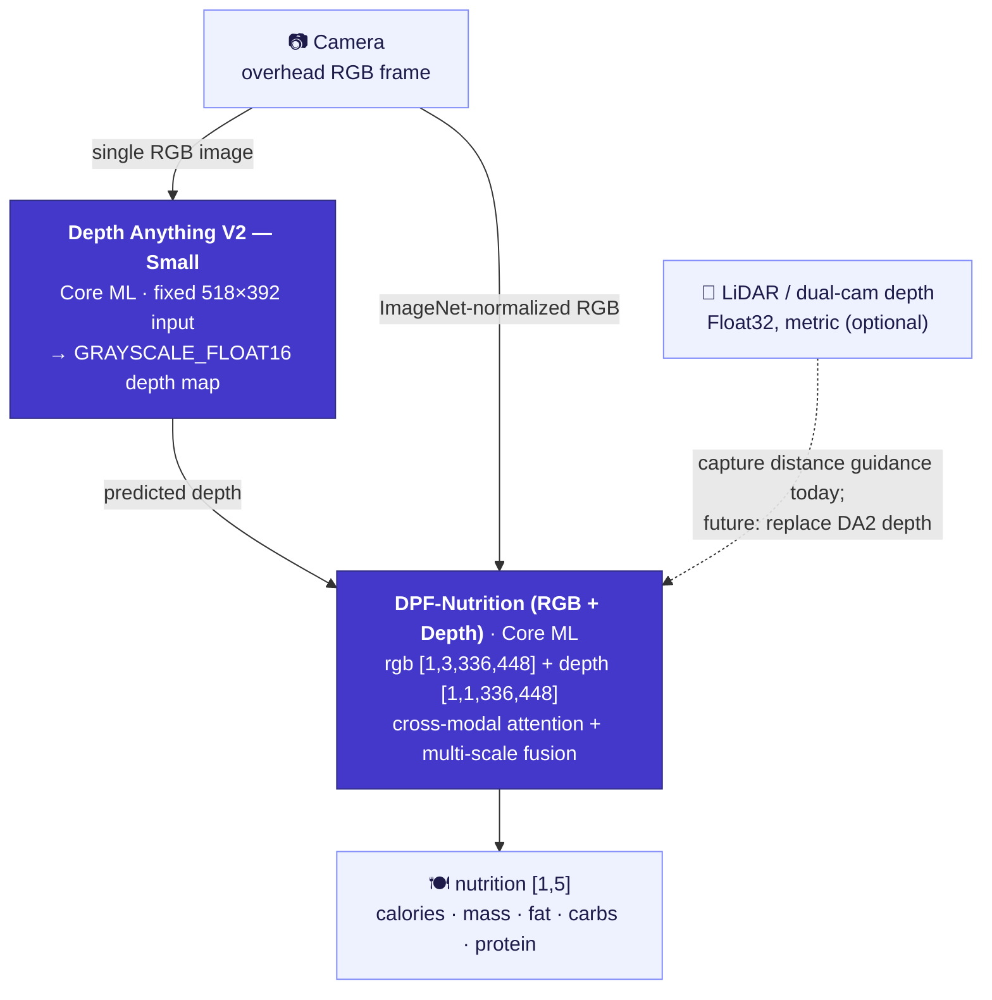

<div align="center">

[English](README.md) | [简体中文](README.zh-Hans.md) | [繁體中文](README.zh-Hant.md) | **日本語** | [한국어](README.ko.md) | [Español](README.es.md) | [Português (Brasil)](README.pt-BR.md) | [Français](README.fr.md) | [Deutsch](README.de.md)

# CalBro — iOS向けオンデバイス食事カロリー・栄養トラッキング

**真上から撮った食事写真1枚からカロリーとマクロ栄養素を推定する、ネイティブSwiftUI製のiPhoneアプリです。Depth-Anything-V2 → DPF-NutritionのCore MLパイプラインにより、処理はすべてデバイス上で完結します。**

[](https://www.apple.com/ios/)
[](https://developer.apple.com/xcode/swiftui/)
[-5B5BD6)](https://developer.apple.com/documentation/coreml)
[](https://github.com/T0MYYY/nutrition5k-calorie-estimation)
[](https://huggingface.co/T0MYYY/dpf-nutrition)

</div>

> ⚠️ **研究用プロトタイプであり、キャリブレーション済みの製品ではありません。** ビジョンバックボーンはiPhoneのカメラ・センサーに対して厳密なキャリブレーションが**行われていません**。出力される栄養値には**参考価値がなく**、医療・食事・臨床上の判断に使用してはいけません。詳しくは[制限事項](#制限事項)を参照してください。

本リポジトリは、研究リポジトリ[**Nutrition5k — Vision-Based Food Calorie & Nutrition Estimation**](https://github.com/T0MYYY/nutrition5k-calorie-estimation)の**応用・デプロイ版**です。

> **CalBroはどのモデルを使っていますか？** CalBroに搭載しているのは **[DPF-Nutrition](https://arxiv.org/abs/2310.11702)** モデル（*Depth Prediction and Fusion*、Han et al., *Foods* 2023）であり、CVPR 2021の *Nutrition5k* アーキテクチャでは**ありません**。DPF-Nutritionは単眼RGB → 深度推定 → RGB-D融合という流れの回帰モデルで、スマートフォンで写真を1枚撮るだけのユースケースにまさに適しています。研究リポジトリではCVPR 2021の実験とDPF-Nutritionの*両方*を再現しており、**CalBroはそのうちDPF-Nutritionのトラックをデプロイしています。** 学習済みモデルをCore MLに変換し、完全オフラインで動作する洗練されたiOSアプリに組み込んでいます。

---

## スクリーンショット

| オンボーディング | 今日 | 栄養 | 統計 |
|:---:|:---:|:---:|:---:|
|  |  |  |  |
| 目標に基づくカロリー目標の設定 | 1日のリング、マクロリング、食事記録、週間ストリップ | 目標、エネルギー配分、食事ごとの内訳 | 過去7日間、推移とマクロ平均 |

| 今日（ダーク） | スキャン結果 | プロフィール（ダーク） | 体重予測 |
|:---:|:---:|:---:|:---:|
|  |  |  |  |
| ライト／ダークテーマに完全対応 | 分量調整付きの推定結果 | カロリー予算、マクロ目標、週間サマリー | プランから算出した目標達成日 |

---

## 主な機能

- **食事をスキャン。** スマートフォンを皿の真上に向けます。オンデバイスのガイダンス機能（CoreMotionによる傾き＋LiDAR／深度による距離）が角度と高さが適切になったタイミングを知らせ、自動で撮影します。
- **栄養をデバイス上で推定。** 撮影したRGBフレームと深度マップを2段階のCore MLパイプラインに通し、**カロリー、質量、脂質、炭水化物、たんぱく質**を予測します。ネットワーク接続もアカウントも不要で、データがスマートフォンの外に出ることはありません。
- **1日を記録。** カロリーリング、マクロリング、編集可能な食事記録、月間カレンダー、週間統計、体重予測シミュレータ、停滞期検出付きの体重の推移を備えています。
- **あなたに合わせてキャリブレーション。** 2週間分の体重記録と食事記録がそろうと、CalBroはMifflin-St Jeor式による維持カロリーの推定値を、あなた自身の摂取量と体重変化から算出した値に置き換え、以降2週間ごとに更新します。
- **システムと連携。** ヘルスケア（身体測定値と体重履歴の読み込み、実測したアクティブエネルギーを1日の予算に反映、記録した食事の保存）、ローカル通知によるリマインダー、WidgetKit＋App Groupによるホーム画面／ロック画面ウィジェットに対応しています。
- **多言語対応。** 英語、簡体字中国語、繁体字中国語、日本語、韓国語、スペイン語、ブラジルポルトガル語、フランス語、ドイツ語に対応し、メートル法とヤード・ポンド法の両方の単位を扱えます。

---

## オンデバイスMLパイプライン



- **ステージ1 — 深度。** Core MLに変換した[Depth Anything V2 Small](https://github.com/DepthAnything/Depth-Anything-V2)が、1枚のRGBフレームから密な深度マップを推定します（入力サイズは**518×392**固定）。LiDAR搭載のiPhoneでは、ハードウェアの深度ストリームをカメラを適切な高さへ誘導するために使っていますが、モデルへの入力にはまだ使っていません。
- **ステージ2 — 栄養。** 自作の**DPF-Nutrition** RGB-D回帰モデル（[研究リポジトリ](https://github.com/T0MYYY/nutrition5k-calorie-estimation)で学習）が、ImageNet正規化したRGBと深度マップを入力として、5つの栄養値を回帰します。
- 両モデルともアプリにバンドルされており、初回使用時にコンパイル（30〜60秒）されて `.mlmodelc` としてキャッシュされ、起動ごとに1回だけ読み込まれます。読み込みはカメラを開いた時点で始まります。

実装：`CalBro/Services/NutritionPredictionService.swift`、`ImagePreprocessing.swift`、`CameraCaptureController.swift`。

---

## アーキテクチャ

- **SwiftUI＋`@Observable` によるMVVM**、iOS 27、Swift 6のstrict concurrency、3タブ構成（今日／統計／プロフィール）。カメラは「今日」画面の **+** ボタンから起動するフルスクリーンのモーダルです。
- **データの一元管理（single source of truth）**：`ProfileStore`（プロフィール＋体重記録）と `MealLogStore`（食事＋日ごとの合計）をすべての画面が直接監視するため、編集内容は即座にすべての画面に反映されます。
- **撮影ガイダンス**（`CameraCaptureController`、`CameraFlowViewModel`）：真の深度を得るために `.builtInLiDARDepthCamera` を選択し、真上からの傾き（28°未満）**かつ** **27〜34 cm**の高さ範囲に収まったときだけ自動撮影します。距離は単位のない距離バーで表示します。手動シャッターは常に使用できます。
- **永続化**：食事（約13か月分）、プロフィール、体重記録、設定を `UserDefaults` に保存し、ウィジェット用に今日のスナップショットを **App Group**（`group.com.wydfcc.calbro`）にミラーリングします。
- **WidgetKit**（`CalBroWidget/`）：ホーム画面（小／中）とロック画面（円形／長方形）のウィジェット。アプリ内のプレビューも同じビュー（`Shared/NutritionWidgetFace.swift`）で描画します。タイムラインは変更のたびに再読み込みされ、深夜0時に切り替わります。
- **HealthKit**（`HealthKitService`、`IntegrationViewModel`）：各機能は個別にオプトインです。身体測定値＋体重履歴、アクティブエネルギー（今日の予算における活動係数分の上乗せを置き換え）、そして食事のエネルギー／マクロの書き込み（同期識別子付きで、編集や削除も同期されます）。
- **ローカル通知**：指定した時刻に届く食事のリマインダー（すでに記録済みの日はスキップ）と、目標の90 %に達したときに1日1回届く警告。
- **ローカライズ**：アプリとウィジェットで共有するString Catalog（`Localizable.xcstrings`、`InfoPlist.xcstrings`）。日付、数値、単位はシステムのフォーマッタを使用します。
- **単位**：身長と体重はメートル法またはヤード・ポンド法（オンボーディングとプロフィールで設定）。カロリーは常にkcalです。

```
CalBro/
├── Models/            UserProfile, LoggedMeal, nutrition & camera models
├── ViewModels/        Dashboard, CameraFlow, Calendar, Goals, Integration, …
├── Services/          CoreML pipeline, camera, HealthKit, reminders, meal store
├── Shared/            SharedNutrition.swift (App Group bridge, app + widget)
├── Views/             Today, Camera, Calendar, Stats, Goals, Integrations, …
├── DesignSystem/      CBColors / CBTypography / CBGlass / CBComponents
└── Resources/Models/  bundled Core ML packages (DA2 + DPF)
CalBroWidget/          WidgetKit extension
```

---

## ビルドと実行

1. Core MLモデル（サイズが大きいためgitには含めていません）を `CalBro/Resources/Models/` に配置します。詳細は[`MODELS.md`](CalBro/Resources/Models/MODELS.md)を参照してください。モデルがない場合、カメラ画面にモデルがインストールされていない旨が表示されます。
2. Xcodeプロジェクトは[XcodeGen](https://github.com/yonaskolb/XcodeGen)で `project.yml` から生成しています（`xcodegen generate`）。生成済みのプロジェクトもコミットしてあります。
3. **Xcode 27以降**で `CalBro.xcodeproj` を開き、**CalBro**スキームを選択します。
4. iOS 27のデバイスで実行します（深度を使うにはLiDAR搭載のiPhone Proを推奨）。

```bash
# Simulator build
xcodebuild -project CalBro.xcodeproj -scheme CalBro \
  -destination 'platform=iOS Simulator,name=iPhone 18 Pro' -configuration Debug build

# Device build (automatic signing registers App Group + HealthKit + widget)
xcodebuild -project CalBro.xcodeproj -scheme CalBro \
  -destination 'generic/platform=iOS' -configuration Debug -allowProvisioningUpdates build
```

```bash
# Unit tests
xcodebuild -project CalBro.xcodeproj -scheme CalBro \
  -destination 'platform=iOS Simulator,name=iPhone 18 Pro' test
```

使用しているCapability：**App Groups**、**HealthKit**、**Camera**、**User Notifications**、**WidgetKit**。

---

## 制限事項

**本アプリは学生プロジェクトであり、その栄養出力は信頼できません。** 包み隠さず挙げると、制約は次のとおりです。

- **バックボーンは厳密にキャリブレーションされていません。** ビジョンモデルは、iPhoneカメラの内部パラメータや、デバイス上で撮影した実際の盛り付け料理の正解データに対してキャリブレーションされていません。**出力される数値には参考価値がありません。** 測定値ではなく、UI／アーキテクチャのデモとして扱ってください。
- **データ不足のため、ここではキャリブレーションが不可能です。** スマートフォン撮影向けに深度／栄養モデルをキャリブレーションするには、デバイスごとの、重量を実測した正解付きの大規模データセットが必要です。**1日4食を丸1年**記録しても得られるのは**約1,460枚**の写真だけで、センサー＋モデルのパイプラインをキャリブレーションするにはまったく足りません。しかもこれは、**iPhoneのモデル（レンズ、LiDAR、ISP）ごとに個別の適応がおそらく必要になる**という点を考慮していない数字です。
- **単眼深度は代用にすぎません。** Depth Anything V2は1枚のRGBフレームから相対深度を推定するもので、メートル単位の絶対深度ではなく、食品や分量の形状向けにも調整されていません。
- **食品データベースや分量の事前知識はありません。** バックエンド、食品認識データベース、食材ごとの内訳は存在せず、あるのはエンドツーエンド回帰モデルが出力する5つの数値だけです。

> **CalBroを医療・食事・臨床上の判断に使用しないでください。** 本アプリは研究・エンジニアリング用のプロトタイプです。

---

## 今後の課題

- **iPhoneのLiDAR深度を直接利用する。** ハードウェアの深度フレーム（`kCVPixelFormatType_DepthFloat32`、メートル単位の絶対値）は、**単眼のDepth-Anythingステージを完全に置き換えられる**大きな可能性を秘めています。アプリはすでに距離ガイダンスのためにこれをストリーミングしています。足りないのは、実際のLiDAR深度でDPFを再学習／キャリブレーションするための**データ収集**であり、これは本プロジェクトの範囲では実現できません。
- **CLIP／VLMとの融合。** CLIP系の画像・テキストモデル（食品カテゴリの事前知識、オープンボキャブラリ認識）をRGB-D回帰モデルと融合することは、精度向上と食材ごとの内訳の両面で有望な方向性です。
- **デバイスごとのキャリブレーションと本格的な正解データセット**（複数のiPhoneモデルで重量を実測した食事）。
- 料理名の推定（モデルは栄養素を予測するだけで、料理が何かは判別しません）とライブアクティビティ。

---

## 研究リポジトリとの関係

CalBroは **[T0MYYY/nutrition5k-calorie-estimation](https://github.com/T0MYYY/nutrition5k-calorie-estimation)** のデプロイ版です。モデルの学習とCVPR 2021論文の再現はそちらで行っています。手法、評価指標、ライブWebデモについてはそちらのリポジトリを参照してください。

## 引用

CalBroは **DPF-Nutrition** モデルをデプロイしています。本プロジェクトを利用する場合は、元の論文を引用してください。

```bibtex
@article{han2023dpfnutrition,
  title   = {DPF-Nutrition: Food Nutrition Estimation via Depth Prediction and Fusion},
  author  = {Han, Yuzhe and Cheng, Qimin and Wu, Wenjin and Huang, Ziyang},
  journal = {Foods},
  volume  = {12},
  number  = {23},
  pages   = {4293},
  year    = {2023},
  doi     = {10.3390/foods12234293}
}
```

データセットと元のベンチマーク：

```bibtex
@inproceedings{thames2021nutrition5k,
  title     = {Nutrition5k: Towards Automatic Nutritional Understanding of Generic Food},
  author    = {Thames, Quin and Karpur, Arjun and Norris, Wade and Xia, Fangting and Panait, Liviu and Weyand, Tobias and Sim, Jack},
  booktitle = {CVPR},
  year      = {2021}
}
```

深度バックボーン：[Depth Anything V2](https://github.com/DepthAnything/Depth-Anything-V2)（Yang et al., 2024）。

## ライセンス／免責事項

[MIT License](LICENSE)のもとで公開しています。

研究・教育用のプロトタイプです。栄養出力は検証されて**おらず**、健康に関する判断の根拠にしてはいけません。
