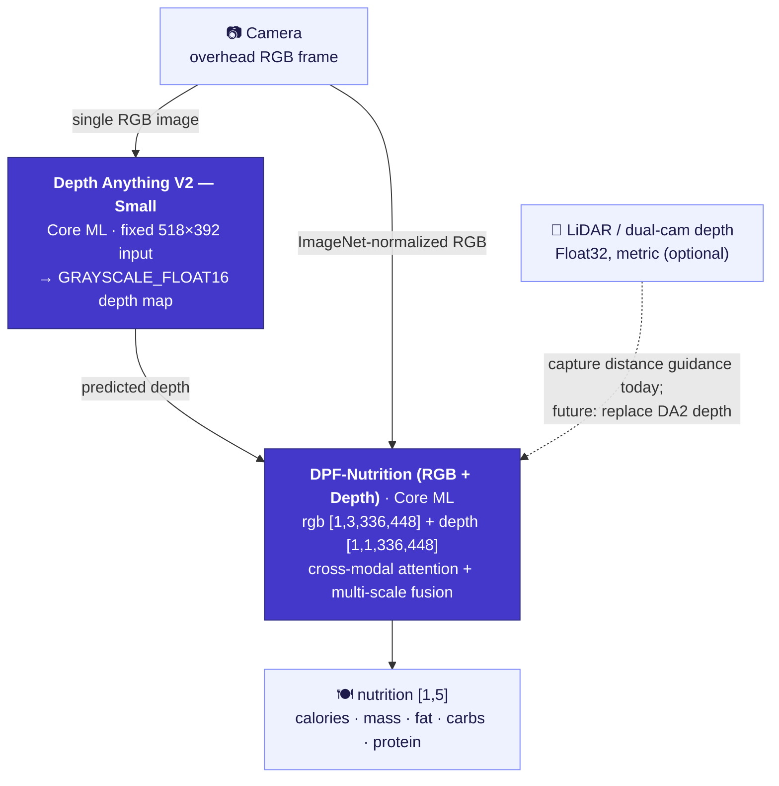

<div align="center">

[English](README.md) | [简体中文](README.zh-Hans.md) | [繁體中文](README.zh-Hant.md) | [日本語](README.ja.md) | **한국어** | [Español](README.es.md) | [Português (Brasil)](README.pt-BR.md) | [Français](README.fr.md) | [Deutsch](README.de.md)

# CalBro — iOS용 온디바이스 음식 칼로리 및 영양 트래킹

**위에서 내려다보고 찍은 음식 사진 한 장으로 칼로리와 다량 영양소를 추정하는 네이티브 SwiftUI iPhone 앱입니다. Depth-Anything-V2 → DPF-Nutrition Core ML 파이프라인을 사용하며, 모든 처리가 기기 내에서 이루어집니다.**

[](https://www.apple.com/ios/)
[](https://developer.apple.com/xcode/swiftui/)
[-5B5BD6)](https://developer.apple.com/documentation/coreml)
[](https://github.com/T0MYYY/nutrition5k-calorie-estimation)
[](https://huggingface.co/T0MYYY/dpf-nutrition)

</div>

> ⚠️ **연구용 프로토타입이며, 보정된 제품이 아닙니다.** 비전 백본은 iPhone 카메라와 센서에 맞춰 엄밀하게 보정되지 **않았습니다**. 이 앱이 내놓는 영양 수치는 **참고 가치가 없으며**, 의료·식단·임상적 판단에 사용해서는 안 됩니다. [제한 사항](#제한-사항)을 참고하세요.

이 저장소는 연구 저장소 [**Nutrition5k — Vision-Based Food Calorie & Nutrition Estimation**](https://github.com/T0MYYY/nutrition5k-calorie-estimation)의 **응용·배포용 짝 프로젝트**입니다.

> **CalBro는 어떤 모델을 사용하나요?** CalBro에는 **[DPF-Nutrition](https://arxiv.org/abs/2310.11702)** 모델(*Depth Prediction and Fusion*, Han et al., *Foods* 2023)이 탑재되어 있으며, CVPR 2021 *Nutrition5k* 아키텍처는 **사용하지 않습니다**. DPF-Nutrition은 단안 RGB → 깊이 예측 → RGB-D 융합으로 이어지는 회귀 모델로, 휴대폰으로 사진 한 장을 찍는 상황에 딱 맞습니다. 연구 저장소에서는 CVPR 2021 실험과 DPF-Nutrition을 *모두* 재현했으며, **CalBro는 그중 DPF-Nutrition 트랙을 배포합니다.** 학습된 모델을 Core ML로 변환해 완전히 오프라인으로 동작하는 완성도 높은 iOS 앱에 담았습니다.

---

## 스크린샷

| 온보딩 | 오늘 | 영양 | 통계 |
|:---:|:---:|:---:|:---:|
|  |  |  |  |
| 목표 기반 칼로리 목표 설정 | 일일 링, 매크로 링, 식사 기록, 주간 스트립 | 목표, 에너지 구성, 식사별 상세 | 최근 7일, 추이 및 매크로 평균 |

| 오늘(다크) | 스캔 결과 | 프로필(다크) | 체중 예측 |
|:---:|:---:|:---:|:---:|
|  |  |  |  |
| 라이트/다크 테마 완벽 지원 | 분량 조정이 가능한 추정 결과 | 칼로리 예산, 매크로 목표, 주간 요약 | 플랜 기준 목표 달성일 |

---

## 주요 기능

- **식사 스캔.** 휴대폰을 접시 바로 위에서 아래로 향하게 들면 됩니다. 기기 내 가이드 시스템(CoreMotion 기울기 + LiDAR/깊이 거리)이 각도와 높이가 맞는 순간을 알려 주고 자동으로 촬영합니다.
- **기기 내 영양 추정.** 촬영한 RGB 프레임과 깊이 맵을 2단계 Core ML 파이프라인에 넣어 **칼로리, 질량, 지방, 탄수화물, 단백질**을 예측합니다. 네트워크도 계정도 필요 없고, 데이터는 휴대폰 밖으로 나가지 않습니다.
- **하루 기록.** 칼로리 링, 매크로 링, 편집 가능한 식사 기록, 월간 캘린더, 주간 통계, 체중 예측 시뮬레이터, 정체기 감지 기능이 있는 체중 추이를 제공합니다.
- **나에게 맞춘 보정.** 2주 동안 체중과 식사를 기록하면 CalBro는 Mifflin-St Jeor 공식 기반의 유지 칼로리 추정치를 실제 섭취량과 체중 변화로 계산한 값으로 바꾸고, 이후 2주마다 갱신합니다.
- **시스템 연동.** 건강 앱(신체 측정값과 체중 기록 가져오기, 측정된 활동 에너지를 일일 예산에 반영, 기록한 식사 저장), 로컬 알림 리마인더, WidgetKit + App Group 기반의 홈 화면/잠금 화면 위젯을 지원합니다.
- **현지화.** 영어, 중국어 간체, 중국어 번체, 일본어, 한국어, 스페인어, 브라질 포르투갈어, 프랑스어, 독일어를 지원하며, 미터법과 야드파운드법 단위를 모두 제공합니다.

---

## 온디바이스 ML 파이프라인



- **1단계 — 깊이.** Core ML로 변환한 [Depth Anything V2 Small](https://github.com/DepthAnything/Depth-Anything-V2)이 RGB 프레임 한 장으로부터 조밀한 깊이 맵을 추정합니다(입력 크기 **518×392** 고정). LiDAR가 탑재된 iPhone에서는 하드웨어 깊이 스트림을 카메라를 적절한 높이로 안내하는 데 사용하며, 아직 모델 입력으로는 사용하지 않습니다.
- **2단계 — 영양.** 직접 개발한 **DPF-Nutrition** RGB-D 회귀 모델([연구 저장소](https://github.com/T0MYYY/nutrition5k-calorie-estimation)에서 학습)이 ImageNet 정규화된 RGB와 깊이 맵을 입력받아 다섯 가지 영양 수치를 회귀합니다.
- 두 모델 모두 앱에 번들로 포함되어 있으며, 처음 사용할 때 컴파일(30~60초)된 뒤 `.mlmodelc`로 캐시되고, 실행할 때마다 한 번만 로드됩니다. 로드는 카메라를 여는 시점에 시작됩니다.

구현: `CalBro/Services/NutritionPredictionService.swift`, `ImagePreprocessing.swift`, `CameraCaptureController.swift`.

---

## 아키텍처

- **SwiftUI + `@Observable` MVVM**, iOS 27, Swift 6 strict concurrency, 3탭 구조(오늘 / 통계 / 프로필). 카메라는 오늘 화면의 **+** 버튼으로 여는 전체 화면 모달입니다.
- **단일 진실 공급원(single source of truth)**: 모든 화면이 `ProfileStore`(프로필 + 체중 기록)와 `MealLogStore`(식사 + 일별 합계)를 직접 관찰하므로, 수정 사항이 모든 화면에 즉시 반영됩니다.
- **촬영 가이드**(`CameraCaptureController`, `CameraFlowViewModel`): 실제 깊이를 얻기 위해 `.builtInLiDARDepthCamera`를 선택하고, 위에서 내려다보는 기울기(28° 미만) **및** **27~34 cm** 높이 범위를 모두 만족할 때만 자동 촬영합니다. 거리는 단위 없는 거리 막대로 표시됩니다. 수동 셔터는 언제든 사용할 수 있습니다.
- **데이터 저장**: 식사(약 13개월분), 프로필, 체중 기록, 설정을 `UserDefaults`에 저장하고, 위젯을 위해 오늘의 스냅샷을 **App Group**(`group.com.wydfcc.calbro`)에 미러링합니다.
- **WidgetKit**(`CalBroWidget/`): 홈 화면(소형/중형) 위젯과 잠금 화면(원형/직사각형) 위젯. 앱 내 미리보기도 같은 뷰(`Shared/NutritionWidgetFace.swift`)로 렌더링합니다. 타임라인은 변경이 있을 때마다 다시 로드되고 자정에 넘어갑니다.
- **HealthKit**(`HealthKitService`, `IntegrationViewModel`): 각 기능은 개별적으로 선택해 켤 수 있습니다. 신체 측정값 + 체중 기록, 활동 에너지(오늘 예산의 활동 계수 기반 추가분을 대체), 그리고 식사의 에너지/매크로 기록(동기화 식별자를 함께 저장해 수정과 삭제도 일관되게 반영).
- **로컬 알림**: 지정한 시간에 보내는 식사 알림(이미 기록한 날은 건너뜀)과, 목표의 90 %에 도달했을 때 하루 한 번 보내는 경고.
- **현지화**: 앱과 위젯이 공유하는 String Catalog(`Localizable.xcstrings`, `InfoPlist.xcstrings`). 날짜, 숫자, 단위는 시스템 포매터를 사용합니다.
- **단위**: 키와 체중은 미터법 또는 야드파운드법(온보딩과 프로필에서 설정). 칼로리는 항상 kcal입니다.

```
CalBro/
├── Models/            UserProfile, LoggedMeal, nutrition & camera models
├── ViewModels/        Dashboard, CameraFlow, Calendar, Goals, Integration, …
├── Services/          CoreML pipeline, camera, HealthKit, reminders, meal store
├── Shared/            SharedNutrition.swift (App Group bridge, app + widget)
├── Views/             Today, Camera, Calendar, Stats, Goals, Integrations, …
├── DesignSystem/      CBColors / CBTypography / CBGlass / CBComponents
└── Resources/Models/  bundled Core ML packages (DA2 + DPF)
CalBroWidget/          WidgetKit extension
```

---

## 빌드 및 실행

1. Core ML 모델(용량이 커서 git에는 포함하지 않음)을 `CalBro/Resources/Models/`에 넣습니다. 자세한 내용은 [`MODELS.md`](CalBro/Resources/Models/MODELS.md)를 참고하세요. 모델이 없으면 카메라 화면에 모델이 설치되지 않았다는 메시지가 표시됩니다.
2. Xcode 프로젝트는 [XcodeGen](https://github.com/yonaskolb/XcodeGen)으로 `project.yml`에서 생성합니다(`xcodegen generate`). 생성된 프로젝트도 함께 커밋되어 있습니다.
3. **Xcode 27 이상**에서 `CalBro.xcodeproj`를 열고 **CalBro** 스킴을 선택합니다.
4. iOS 27 기기에서 실행합니다(깊이 기능에는 LiDAR가 탑재된 iPhone Pro 권장).

```bash
# Simulator build
xcodebuild -project CalBro.xcodeproj -scheme CalBro \
  -destination 'platform=iOS Simulator,name=iPhone 18 Pro' -configuration Debug build

# Device build (automatic signing registers App Group + HealthKit + widget)
xcodebuild -project CalBro.xcodeproj -scheme CalBro \
  -destination 'generic/platform=iOS' -configuration Debug -allowProvisioningUpdates build
```

```bash
# Unit tests
xcodebuild -project CalBro.xcodeproj -scheme CalBro \
  -destination 'platform=iOS Simulator,name=iPhone 18 Pro' test
```

사용하는 Capability: **App Groups**, **HealthKit**, **Camera**, **User Notifications**, **WidgetKit**.

---

## 제한 사항

**이 앱은 학생 프로젝트이며, 영양 출력값은 신뢰할 수 없습니다.** 솔직하게 밝히는 제약 사항은 다음과 같습니다.

- **백본은 엄밀하게 보정되지 않았습니다.** 비전 모델은 iPhone 카메라 내부 파라미터나 기기에서 촬영한 실제 음식의 정답 데이터에 맞춰 보정되지 않았습니다. **출력되는 수치에는 참고 가치가 없습니다.** 측정값이 아니라 UI/아키텍처 데모로만 여겨 주세요.
- **데이터가 부족해 여기서는 보정이 불가능합니다.** 휴대폰 촬영용 깊이/영양 모델을 보정하려면 기기별로 무게를 실측한 정답 데이터가 담긴 대규모 데이터셋이 필요합니다. **하루 4끼를 꼬박 1년** 기록해도 사진은 **약 1,460장**에 불과해 센서 + 모델 파이프라인을 보정하기에는 턱없이 부족하며, 이는 **iPhone 모델(렌즈, LiDAR, ISP)마다 별도의 적응이 필요할 가능성이 높다**는 점을 고려하지 않은 수치입니다.
- **단안 깊이는 대리 지표일 뿐입니다.** Depth Anything V2는 RGB 프레임 한 장으로 상대 깊이를 추정하며, 미터 단위의 절대 깊이가 아니고 음식이나 분량의 형상에 맞춰 조정되지도 않았습니다.
- **음식 데이터베이스나 분량 사전 정보가 없습니다.** 백엔드, 음식 인식 데이터베이스, 재료별 상세 정보가 없으며, 엔드투엔드 회귀 모델이 출력하는 다섯 가지 수치만 있습니다.

> **CalBro를 의료·식단·임상적 판단에 사용하지 마세요.** 이 앱은 연구/엔지니어링용 프로토타입입니다.

---

## 향후 과제

- **iPhone LiDAR 깊이를 직접 사용.** 하드웨어 깊이 프레임(`kCVPixelFormatType_DepthFloat32`, 미터 단위 절대값)은 **단안 Depth-Anything 단계를 완전히 대체**할 수 있는 큰 잠재력이 있습니다. 앱은 이미 거리 가이드를 위해 이를 스트리밍하고 있습니다. 부족한 것은 실제 LiDAR 깊이로 DPF를 재학습/보정하기 위한 **데이터 수집**이며, 이는 이 프로젝트에서는 현실적으로 불가능합니다.
- **CLIP / VLM 융합.** CLIP 계열의 이미지-텍스트 모델(음식 카테고리 사전 정보, 오픈 보캐뷸러리 인식)을 RGB-D 회귀 모델과 융합하는 것은 정확도와 재료별 상세 정보 양쪽에서 유망한 방향입니다.
- **기기별 보정과 실제 정답 데이터셋**(여러 iPhone 모델에서 무게를 실측한 식사).
- 음식 이름 인식(모델은 영양소를 예측할 뿐 어떤 요리인지는 알려 주지 않음)과 실시간 현황(Live Activities).

---

## 연구 저장소와의 관계

CalBro는 **[T0MYYY/nutrition5k-calorie-estimation](https://github.com/T0MYYY/nutrition5k-calorie-estimation)** 의 배포 트랙으로, 모델 학습과 CVPR 2021 논문 재현은 해당 저장소에서 이루어집니다. 방법론, 평가 지표, 라이브 웹 데모는 해당 저장소를 참고하세요.

## 인용

CalBro는 **DPF-Nutrition** 모델을 배포합니다. 이 프로젝트를 사용하신다면 원 논문을 인용해 주세요.

```bibtex
@article{han2023dpfnutrition,
  title   = {DPF-Nutrition: Food Nutrition Estimation via Depth Prediction and Fusion},
  author  = {Han, Yuzhe and Cheng, Qimin and Wu, Wenjin and Huang, Ziyang},
  journal = {Foods},
  volume  = {12},
  number  = {23},
  pages   = {4293},
  year    = {2023},
  doi     = {10.3390/foods12234293}
}
```

데이터셋과 원래 벤치마크:

```bibtex
@inproceedings{thames2021nutrition5k,
  title     = {Nutrition5k: Towards Automatic Nutritional Understanding of Generic Food},
  author    = {Thames, Quin and Karpur, Arjun and Norris, Wade and Xia, Fangting and Panait, Liviu and Weyand, Tobias and Sim, Jack},
  booktitle = {CVPR},
  year      = {2021}
}
```

깊이 백본: [Depth Anything V2](https://github.com/DepthAnything/Depth-Anything-V2) (Yang et al., 2024).

## 라이선스 / 면책 조항

[MIT License](LICENSE)에 따라 배포됩니다.

연구/교육용 프로토타입입니다. 영양 출력값은 검증되지 **않았으며**, 건강 관련 결정의 근거로 사용해서는 안 됩니다.
