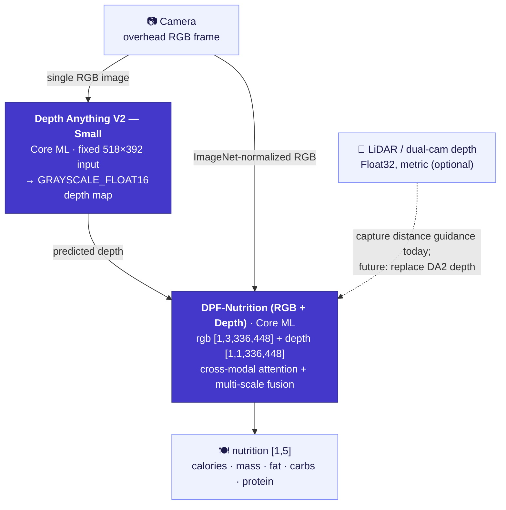

<div align="center">

[English](README.md) | [简体中文](README.zh-Hans.md) | [繁體中文](README.zh-Hant.md) | [日本語](README.ja.md) | [한국어](README.ko.md) | [Español](README.es.md) | **Português (Brasil)** | [Français](README.fr.md) | [Deutsch](README.de.md)

# CalBro — Acompanhamento de calorias e nutrição no dispositivo para iOS

**Um app nativo em SwiftUI para iPhone que estima calorias e macronutrientes a partir de uma única foto do prato tirada de cima, totalmente no dispositivo, usando um pipeline Core ML Depth-Anything-V2 → DPF-Nutrition.**

[](https://www.apple.com/ios/)
[](https://developer.apple.com/xcode/swiftui/)
[-5B5BD6)](https://developer.apple.com/documentation/coreml)
[](https://github.com/T0MYYY/nutrition5k-calorie-estimation)
[](https://huggingface.co/T0MYYY/dpf-nutrition)

</div>

> ⚠️ **Protótipo de pesquisa, não um produto calibrado.** O backbone de visão **não** foi calibrado rigorosamente para as câmeras e sensores do iPhone. Os valores nutricionais que ele produz **não têm valor de referência** e não devem ser usados para decisões médicas, alimentares ou clínicas. Veja [Limitações](#limitações).

Este é o **complemento aplicado / de implantação** do nosso repositório de pesquisa [**Nutrition5k — Vision-Based Food Calorie & Nutrition Estimation**](https://github.com/T0MYYY/nutrition5k-calorie-estimation).

> **Qual modelo o CalBro usa?** O CalBro traz o modelo **[DPF-Nutrition](https://arxiv.org/abs/2310.11702)** — *Depth Prediction and Fusion* (Han et al., *Foods* 2023) — e **não** a arquitetura *Nutrition5k* do CVPR 2021. O DPF-Nutrition é um regressor monocular RGB → profundidade prevista → fusão RGB-D, exatamente o que combina com uma captura de foto única pelo celular. Nosso repositório de pesquisa reproduz *tanto* os experimentos do CVPR 2021 quanto o DPF-Nutrition; **o CalBro implanta a vertente DPF-Nutrition.** Convertemos esse modelo treinado para Core ML e o embarcamos em um app iOS bem acabado que funciona totalmente offline.

---

## Capturas de tela

| Configuração inicial | Hoje | Nutrição | Estatísticas |
|:---:|:---:|:---:|:---:|
|  |  |  |  |
| Meta calórica definida pelo seu objetivo | Anel diário, anéis de macros, registro de refeições, faixa da semana | Metas, divisão de energia, detalhamento por refeição | Últimos 7 dias, tendência e médias de macros |

| Hoje (escuro) | Resultado do escaneamento | Perfil (escuro) | Previsão de peso |
|:---:|:---:|:---:|:---:|
|  |  |  |  |
| Tema claro/escuro completo | Estimativa com ajuste de porção | Orçamento calórico, metas de macros, resumo semanal | Data prevista com base no seu plano |

---

## O que ele faz

- **Escaneie uma refeição.** Aponte o celular direto para baixo, sobre o prato. Um sistema de orientação no dispositivo (inclinação via CoreMotion + distância via LiDAR/profundidade) avisa quando o ângulo e a altura estão certos e captura automaticamente.
- **Estima a nutrição no dispositivo.** O quadro RGB capturado e um mapa de profundidade passam por um pipeline Core ML de duas etapas que prevê **calorias, massa, gordura, carboidratos e proteína** — sem rede, sem conta e sem que nenhum dado saia do celular.
- **Acompanhe o dia.** Anel de calorias, anéis de macros, registro de refeições editável, calendário mensal, estatísticas semanais, um simulador de previsão de peso e a tendência de peso com detecção de platô.
- **Calibra para você.** Depois de duas semanas de pesagens e registros de refeições, o CalBro pode substituir a estimativa de manutenção de Mifflin-St Jeor por uma calculada a partir da sua própria ingestão e variação de peso, e a atualiza a cada duas semanas.
- **Integra-se ao sistema.** Saúde (importa medidas corporais e histórico de peso, usa a energia ativa medida no orçamento diário e salva as refeições registradas), lembretes por notificações locais e widgets para a Tela de Início e a Tela Bloqueada via WidgetKit + App Group.
- **Localizado** em inglês, chinês simplificado e tradicional, japonês, coreano, espanhol, português do Brasil, francês e alemão, com unidades métricas e imperiais.

---

## O pipeline de ML no dispositivo



- **Etapa 1 — Profundidade.** O [Depth Anything V2 Small](https://github.com/DepthAnything/Depth-Anything-V2), convertido para Core ML, estima um mapa de profundidade denso a partir do único quadro RGB (entrada fixa de **518×392**). Nos iPhones com LiDAR, o fluxo de profundidade do hardware é usado para guiar a câmera até a altura certa; ele ainda não é enviado ao modelo.
- **Etapa 2 — Nutrição.** Nosso regressor RGB-D **DPF-Nutrition** (treinado no [repositório de pesquisa](https://github.com/T0MYYY/nutrition5k-calorie-estimation)) recebe o RGB normalizado pelo ImageNet + o mapa de profundidade e faz a regressão dos cinco valores nutricionais.
- Os dois modelos vêm embarcados no app, são compilados no primeiro uso (30–60 s), ficam em cache como `.mlmodelc` e são carregados uma vez por execução. O carregamento começa quando a câmera é aberta.

Implementação: `CalBro/Services/NutritionPredictionService.swift`, `ImagePreprocessing.swift`, `CameraCaptureController.swift`.

---

## Arquitetura

- **SwiftUI + MVVM com `@Observable`**, iOS 27, concorrência estrita do Swift 6, estrutura com três abas (Hoje / Estatísticas / Perfil). A câmera é um modal em tela cheia aberto pelo botão **+** em Hoje.
- **Fonte única da verdade**: `ProfileStore` (perfil + registro de peso) e `MealLogStore` (refeições + totais por dia) são observados diretamente por todas as telas, então qualquer edição aparece em todo lugar na hora.
- **Orientação de captura** (`CameraCaptureController`, `CameraFlowViewModel`): seleciona `.builtInLiDARDepthCamera` para obter profundidade real e só libera a captura automática com inclinação de cima para baixo (< 28°) **e** altura na faixa de **27–34 cm**, exibida como uma barra de distância sem unidades. O disparador manual está sempre disponível.
- **Persistência**: refeições (≈13 meses), perfil, registro de peso e ajustes em `UserDefaults`; o resumo do dia é espelhado em um **App Group** (`group.com.wydfcc.calbro`) para o widget.
- **WidgetKit** (`CalBroWidget/`): widgets para a Tela de Início (pequeno/médio) e a Tela Bloqueada (circular/retangular). A mesma view (`Shared/NutritionWidgetFace.swift`) renderiza a prévia dentro do app. As timelines são recarregadas a cada mudança e viram o dia à meia-noite.
- **HealthKit** (`HealthKitService`, `IntegrationViewModel`): cada parte é opcional — medidas corporais + histórico de peso, energia ativa (substitui a margem do multiplicador de atividade no orçamento do dia) e gravação de energia/macros das refeições com identificadores de sincronização, para que edições e exclusões fiquem em sincronia.
- **Notificações locais**: um lembrete de refeição no horário escolhido, que é pulado nos dias em que você já registrou algo, e um alerta uma vez por dia ao atingir 90 % da meta.
- **Localização**: String Catalogs (`Localizable.xcstrings`, `InfoPlist.xcstrings`) compartilhados entre o app e o widget; datas, números e unidades usam os formatadores do sistema.
- **Unidades**: altura e peso no sistema métrico ou imperial (configuração inicial e perfil); as calorias são sempre exibidas em kcal.

```
CalBro/
├── Models/            UserProfile, LoggedMeal, nutrition & camera models
├── ViewModels/        Dashboard, CameraFlow, Calendar, Goals, Integration, …
├── Services/          CoreML pipeline, camera, HealthKit, reminders, meal store
├── Shared/            SharedNutrition.swift (App Group bridge, app + widget)
├── Views/             Today, Camera, Calendar, Stats, Goals, Integrations, …
├── DesignSystem/      CBColors / CBTypography / CBGlass / CBComponents
└── Resources/Models/  bundled Core ML packages (DA2 + DPF)
CalBroWidget/          WidgetKit extension
```

---

## Compilar e executar

1. Coloque os modelos Core ML (não estão no git — são grandes demais) em `CalBro/Resources/Models/` — veja [`MODELS.md`](CalBro/Resources/Models/MODELS.md). Sem eles, a câmera informa que o modelo não está instalado.
2. O projeto do Xcode é gerado a partir de `project.yml` com o [XcodeGen](https://github.com/yonaskolb/XcodeGen) (`xcodegen generate`); o projeto gerado também está versionado.
3. Abra `CalBro.xcodeproj` no **Xcode 27+** e selecione o scheme **CalBro**.
4. Execute em um dispositivo com iOS 27 (recomenda-se um iPhone Pro com LiDAR para a profundidade).

```bash
# Simulator build
xcodebuild -project CalBro.xcodeproj -scheme CalBro \
  -destination 'platform=iOS Simulator,name=iPhone 18 Pro' -configuration Debug build

# Device build (automatic signing registers App Group + HealthKit + widget)
xcodebuild -project CalBro.xcodeproj -scheme CalBro \
  -destination 'generic/platform=iOS' -configuration Debug -allowProvisioningUpdates build
```

```bash
# Unit tests
xcodebuild -project CalBro.xcodeproj -scheme CalBro \
  -destination 'platform=iOS Simulator,name=iPhone 18 Pro' test
```

Capabilities utilizadas: **App Groups**, **HealthKit**, **Câmera**, **Notificações do usuário**, **WidgetKit**.

---

## Limitações

**Este app é um projeto de estudante, e seus resultados nutricionais não são confiáveis.** As limitações, com franqueza:

- **O backbone não está calibrado rigorosamente.** O modelo de visão não foi calibrado com os parâmetros intrínsecos da câmera do iPhone nem com dados reais de pratos servidos medidos no dispositivo. **Os valores que ele produz não têm valor de referência** — trate-os como uma demonstração de interface e arquitetura, não como medições.
- **A escassez de dados torna a calibração inviável aqui.** Calibrar um modelo de profundidade/nutrição para capturas pelo celular exige um conjunto de dados grande, específico do dispositivo e com referências pesadas na balança. Registrar **4 refeições por dia durante um ano inteiro** gera apenas **~1.460 fotos** — muito longe do suficiente para calibrar um pipeline de sensor + modelo, e isso sem considerar que **cada modelo de iPhone (lente, LiDAR, ISP) provavelmente precisaria de sua própria adaptação.**
- **A profundidade monocular é uma aproximação.** O Depth Anything V2 estima a profundidade relativa a partir de um único quadro RGB; ela não é métrica e não foi ajustada para a geometria de alimentos e porções.
- **Sem banco de dados de alimentos nem referências de porção.** Não há backend, banco de dados de reconhecimento de alimentos nem detalhamento por ingrediente — apenas os cinco valores do regressor de ponta a ponta.

> **Não use o CalBro para decisões médicas, alimentares ou clínicas.** Ele é um protótipo de pesquisa e engenharia.

---

## Trabalhos futuros

- **Usar diretamente a profundidade do LiDAR do iPhone.** O quadro de profundidade do hardware (`kCVPixelFormatType_DepthFloat32`, métrico, em metros) tem grande potencial para **substituir por completo a etapa monocular do Depth-Anything** — o app já o recebe para a orientação de distância. O que falta é a **coleta de dados** para retreinar/calibrar o DPF com profundidade real do LiDAR, o que não é viável neste projeto.
- **Fusão com CLIP / VLM.** Combinar um modelo imagem-texto no estilo CLIP (referências por categoria de alimento, reconhecimento de vocabulário aberto) com o regressor RGB-D é um caminho promissor tanto para a precisão quanto para o detalhamento por ingrediente.
- **Calibração por dispositivo e um conjunto de dados de referência real** (refeições pesadas em diferentes modelos de iPhone).
- Identificação do prato (o modelo prevê nutrientes, não qual é o prato) e Live Activities.

---

## Relação com o repositório de pesquisa

O CalBro é a vertente de implantação do **[T0MYYY/nutrition5k-calorie-estimation](https://github.com/T0MYYY/nutrition5k-calorie-estimation)** — onde os modelos são treinados e o artigo do CVPR 2021 é reproduzido. Veja esse repositório para a metodologia, as métricas e a demo web ao vivo.

## Citações

O CalBro implanta o modelo **DPF-Nutrition**. Se você usar este trabalho, cite o artigo original:

```bibtex
@article{han2023dpfnutrition,
  title   = {DPF-Nutrition: Food Nutrition Estimation via Depth Prediction and Fusion},
  author  = {Han, Yuzhe and Cheng, Qimin and Wu, Wenjin and Huang, Ziyang},
  journal = {Foods},
  volume  = {12},
  number  = {23},
  pages   = {4293},
  year    = {2023},
  doi     = {10.3390/foods12234293}
}
```

O conjunto de dados e o benchmark original:

```bibtex
@inproceedings{thames2021nutrition5k,
  title     = {Nutrition5k: Towards Automatic Nutritional Understanding of Generic Food},
  author    = {Thames, Quin and Karpur, Arjun and Norris, Wade and Xia, Fangting and Panait, Liviu and Weyand, Tobias and Sim, Jack},
  booktitle = {CVPR},
  year      = {2021}
}
```

Backbone de profundidade: [Depth Anything V2](https://github.com/DepthAnything/Depth-Anything-V2) (Yang et al., 2024).

## Licença / aviso legal

Licenciado sob a [Licença MIT](LICENSE).

Protótipo de pesquisa/educacional. Os resultados nutricionais **não** foram validados e não devem embasar decisões de saúde.
