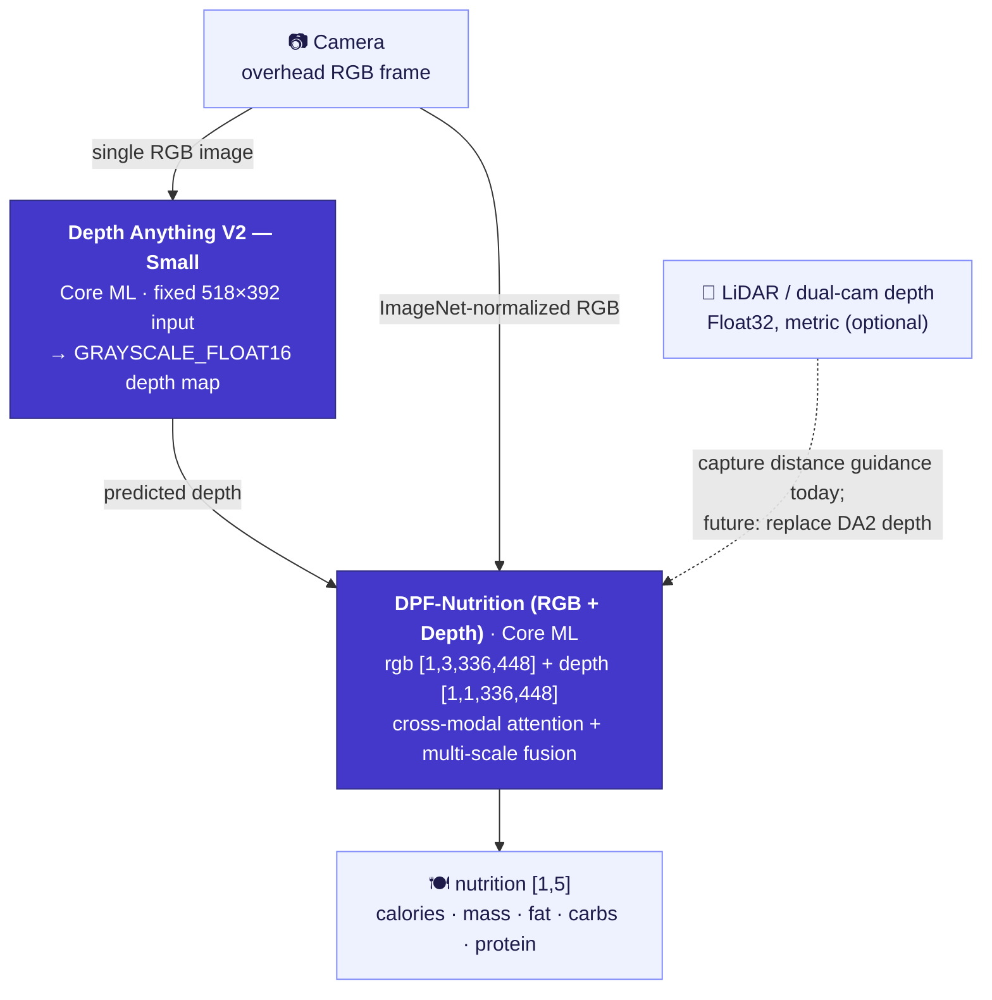

<div align="center">

[English](README.md) | **简体中文** | [繁體中文](README.zh-Hant.md) | [日本語](README.ja.md) | [한국어](README.ko.md) | [Español](README.es.md) | [Português (Brasil)](README.pt-BR.md) | [Français](README.fr.md) | [Deutsch](README.de.md)

# CalBro — iOS 端侧食物热量与营养追踪

**一款原生 SwiftUI iPhone 应用，只需一张俯拍食物照片即可估算热量和宏量营养素，全程在设备端完成，基于 Depth-Anything-V2 → DPF-Nutrition 的 Core ML 流水线。**

[](https://www.apple.com/ios/)
[](https://developer.apple.com/xcode/swiftui/)
[-5B5BD6)](https://developer.apple.com/documentation/coreml)
[](https://github.com/T0MYYY/nutrition5k-calorie-estimation)
[](https://huggingface.co/T0MYYY/dpf-nutrition)

</div>

> ⚠️ **研究原型，并非经过校准的产品。** 视觉主干网络**没有**针对 iPhone 相机和传感器做过严格校准。它给出的营养数值**不具备任何参考价值**，不得用于医疗、饮食或临床决策。详见[局限性](#局限性)。

本项目是我们研究仓库 [**Nutrition5k — Vision-Based Food Calorie & Nutrition Estimation**](https://github.com/T0MYYY/nutrition5k-calorie-estimation) 的**应用 / 部署配套项目**。

> **CalBro 用的是哪个模型？** CalBro 内置的是 **[DPF-Nutrition](https://arxiv.org/abs/2310.11702)** 模型——*Depth Prediction and Fusion*（Han 等，*Foods* 2023），**而不是** CVPR 2021 的 *Nutrition5k* 架构。DPF-Nutrition 是一个“单目 RGB → 预测深度 → RGB-D 融合”的回归模型，正好适合手机单张拍照的场景。我们的研究仓库同时复现了 CVPR 2021 的实验*和* DPF-Nutrition；**CalBro 部署的是 DPF-Nutrition 这条线。** 我们把训练好的模型转换为 Core ML，并集成到一款完全离线运行、打磨完整的 iOS 应用中。

---

## 截图

| 引导设置 | 今天 | 营养 | 统计 |
|:---:|:---:|:---:|:---:|
|  |  |  |  |
| 按目标设定每日热量 | 每日热量环、宏量营养素环、餐食记录、周视图 | 目标、热量来源、每餐明细 | 最近 7 天、趋势与宏量营养素平均值 |

| 今天（深色） | 扫描结果 | 个人资料（深色） | 体重预测 |
|:---:|:---:|:---:|:---:|
|  |  |  |  |
| 完整的浅色 / 深色主题 | 估算结果与份量调整 | 热量预算、宏量营养素目标、每周汇总 | 根据你的计划推算达成日期 |

---

## 功能

- **扫描餐食。** 手机垂直朝下对准餐盘。端侧引导系统（CoreMotion 倾角 + LiDAR / 深度测距）会提示角度和高度是否合适，对准后自动拍摄。
- **在设备端估算营养。** 拍到的 RGB 画面和深度图会送入两阶段 Core ML 流水线，预测**热量、重量、脂肪、碳水、蛋白质**——无需联网，无需账号，数据不会离开手机。
- **追踪每一天。** 热量环、宏量营养素环、可编辑的餐食记录、月历、每周统计、体重预测模拟器，以及带平台期检测的体重趋势。
- **为你个人校准。** 积累两周的称重和餐食记录后，CalBro 可以用根据你自己的摄入量和体重变化推算出的维持热量，替换 Mifflin-St Jeor 公式的估算值，并且每两周更新一次。
- **与系统深度集成。** Apple 健康（导入身体数据和体重历史、在每日预算中使用实测的活动能量、保存已记录的餐食）、本地通知提醒，以及基于 WidgetKit + App Group 的主屏幕 / 锁定屏幕小组件。
- **多语言支持：** 英语、简体中文、繁体中文、日语、韩语、西班牙语、巴西葡萄牙语、法语和德语，并支持公制和英制单位。

---

## 端侧机器学习流水线



- **第一阶段：深度。** 转换为 Core ML 的 [Depth Anything V2 Small](https://github.com/DepthAnything/Depth-Anything-V2) 从单张 RGB 画面估算稠密深度图（固定 **518×392** 输入）。在配备 LiDAR 的 iPhone 上，硬件深度流用于引导相机到达合适的高度，目前还没有输入给模型。
- **第二阶段：营养。** 我们的 **DPF-Nutrition** RGB-D 回归模型（在[研究仓库](https://github.com/T0MYYY/nutrition5k-calorie-estimation)中训练）以 ImageNet 归一化后的 RGB 和深度图为输入，回归出五个营养数值。
- 两个模型都打包在应用内，首次使用时编译（30–60 秒），缓存为 `.mlmodelc`，每次启动只加载一次。打开相机时即开始加载。

实现代码：`CalBro/Services/NutritionPredictionService.swift`、`ImagePreprocessing.swift`、`CameraCaptureController.swift`。

---

## 架构

- **SwiftUI + `@Observable` MVVM**，iOS 27，Swift 6 严格并发检查，三个标签页（今天 / 统计 / 个人资料）。相机是从“今天”页 **+** 按钮打开的全屏模态视图。
- **单一数据源**：`ProfileStore`（个人资料 + 体重记录）和 `MealLogStore`（餐食 + 每日汇总）被所有页面直接观察，任何修改都会立即同步到各处。
- **拍摄引导**（`CameraCaptureController`、`CameraFlowViewModel`）：选用 `.builtInLiDARDepthCamera` 获取真实深度；只有在俯拍倾角（< 28°）**且**高度处于 **27–34 cm** 区间时才自动拍摄，距离以不带单位的进度条显示。手动快门始终可用。
- **持久化**：餐食（约 13 个月）、个人资料、体重记录和设置保存在 `UserDefaults` 中；当天的快照同步到 **App Group**（`group.com.wydfcc.calbro`）供小组件使用。
- **WidgetKit**（`CalBroWidget/`）：主屏幕（小 / 中）和锁定屏幕（圆形 / 矩形）小组件。应用内的预览由同一个视图（`Shared/NutritionWidgetFace.swift`）渲染。每次数据变化都会刷新时间线，并在午夜自动切换到新的一天。
- **HealthKit**（`HealthKitService`、`IntegrationViewModel`）：每项功能都需用户主动开启——身体数据 + 体重历史、活动能量（替代今日预算中按活动系数估算的额度），以及带同步标识符写入餐食的能量 / 宏量营养素，确保编辑和删除保持同步。
- **本地通知**：在指定时间发送用餐提醒（当天已记录则跳过），以及达到目标 90 % 时每天一次的提醒。
- **本地化**：应用和小组件共用 String Catalog（`Localizable.xcstrings`、`InfoPlist.xcstrings`）；日期、数字和单位使用系统格式化器。
- **单位**：身高和体重支持公制或英制（引导设置和个人资料中均可设置）；热量始终以千卡显示。

```
CalBro/
├── Models/            UserProfile, LoggedMeal, nutrition & camera models
├── ViewModels/        Dashboard, CameraFlow, Calendar, Goals, Integration, …
├── Services/          CoreML pipeline, camera, HealthKit, reminders, meal store
├── Shared/            SharedNutrition.swift (App Group bridge, app + widget)
├── Views/             Today, Camera, Calendar, Stats, Goals, Integrations, …
├── DesignSystem/      CBColors / CBTypography / CBGlass / CBComponents
└── Resources/Models/  bundled Core ML packages (DA2 + DPF)
CalBroWidget/          WidgetKit extension
```

---

## 构建与运行

1. 将 Core ML 模型（体积太大，未纳入 git）放入 `CalBro/Resources/Models/`，详见 [`MODELS.md`](CalBro/Resources/Models/MODELS.md)。缺少模型时，相机会提示模型未安装。
2. Xcode 项目由 [XcodeGen](https://github.com/yonaskolb/XcodeGen) 根据 `project.yml` 生成（`xcodegen generate`）；生成的项目也已提交到仓库。
3. 用 **Xcode 27+** 打开 `CalBro.xcodeproj`，选择 **CalBro** scheme。
4. 在 iOS 27 设备上运行（推荐使用带 LiDAR 的 iPhone Pro 以获取深度）。

```bash
# Simulator build
xcodebuild -project CalBro.xcodeproj -scheme CalBro \
  -destination 'platform=iOS Simulator,name=iPhone 18 Pro' -configuration Debug build

# Device build (automatic signing registers App Group + HealthKit + widget)
xcodebuild -project CalBro.xcodeproj -scheme CalBro \
  -destination 'generic/platform=iOS' -configuration Debug -allowProvisioningUpdates build
```

```bash
# Unit tests
xcodebuild -project CalBro.xcodeproj -scheme CalBro \
  -destination 'platform=iOS Simulator,name=iPhone 18 Pro' test
```

使用的能力（Capabilities）：**App Groups**、**HealthKit**、**Camera**、**User Notifications**、**WidgetKit**。

---

## 局限性

**本应用是一个学生项目，其营养输出结果不可信。** 实事求是地说，限制如下：

- **主干网络未经严格校准。** 视觉模型没有针对 iPhone 相机内参做过校准，也没有在设备端用真实装盘食物的真值数据校准过。**它给出的数值不具备任何参考价值**——请把它当作 UI / 架构演示，而不是测量结果。
- **数据匮乏，本项目无法完成校准。** 要为手机拍摄场景校准深度 / 营养模型，需要一个大规模、针对特定设备、经过称重获得真值的数据集。即使**每天记录 4 餐、坚持一整年**，也只能得到**约 1,460 张照片**——远远不足以校准“传感器 + 模型”的流水线，更何况**每款 iPhone（镜头、LiDAR、ISP）很可能都需要单独适配。**
- **单目深度只是近似。** Depth Anything V2 从单张 RGB 画面估算的是相对深度，不是真实尺度的深度，也没有针对食物 / 份量的几何形态做过调优。
- **没有食物数据库，也没有份量先验。** 没有后端、食物识别数据库或按食材的拆分——只有端到端回归模型输出的五个数值。

> **请勿将 CalBro 用于医疗、饮食或临床决策。** 它只是一个研究 / 工程原型。

---

## 未来工作

- **直接使用 iPhone 的 LiDAR 深度。** 硬件深度帧（`kCVPixelFormatType_DepthFloat32`，真实尺度，单位为米）很有潜力**彻底取代单目 Depth-Anything 阶段**——应用已经在读取它用于距离引导。缺少的是用真实 LiDAR 深度重新训练 / 校准 DPF 所需的**数据采集**，而这在本项目中无法实现。
- **CLIP / VLM 融合。** 将 CLIP 类的图文模型（食物类别先验、开放词汇识别）与 RGB-D 回归模型融合，无论对准确率还是按食材拆分，都是很有前景的方向。
- **按设备校准，以及真正的真值数据集**（覆盖多款 iPhone 的称重餐食）。
- 食物命名（模型只预测营养成分，并不识别是什么菜）以及实时活动（Live Activities）。

---

## 与研究仓库的关系

CalBro 是 **[T0MYYY/nutrition5k-calorie-estimation](https://github.com/T0MYYY/nutrition5k-calorie-estimation)** 的部署分支——模型的训练和 CVPR 2021 论文的复现都在那个仓库中完成。方法、指标和在线网页演示请参见该仓库。

## 引用

CalBro 部署的是 **DPF-Nutrition** 模型。如果你使用了本项目，请引用原始论文：

```bibtex
@article{han2023dpfnutrition,
  title   = {DPF-Nutrition: Food Nutrition Estimation via Depth Prediction and Fusion},
  author  = {Han, Yuzhe and Cheng, Qimin and Wu, Wenjin and Huang, Ziyang},
  journal = {Foods},
  volume  = {12},
  number  = {23},
  pages   = {4293},
  year    = {2023},
  doi     = {10.3390/foods12234293}
}
```

数据集及原始基准：

```bibtex
@inproceedings{thames2021nutrition5k,
  title     = {Nutrition5k: Towards Automatic Nutritional Understanding of Generic Food},
  author    = {Thames, Quin and Karpur, Arjun and Norris, Wade and Xia, Fangting and Panait, Liviu and Weyand, Tobias and Sim, Jack},
  booktitle = {CVPR},
  year      = {2021}
}
```

深度主干网络：[Depth Anything V2](https://github.com/DepthAnything/Depth-Anything-V2)（Yang 等，2024）。

## 许可证 / 免责声明

基于 [MIT License](LICENSE) 授权。

研究 / 教学用途的原型。营养输出结果**未经**验证，不得作为健康决策的依据。
