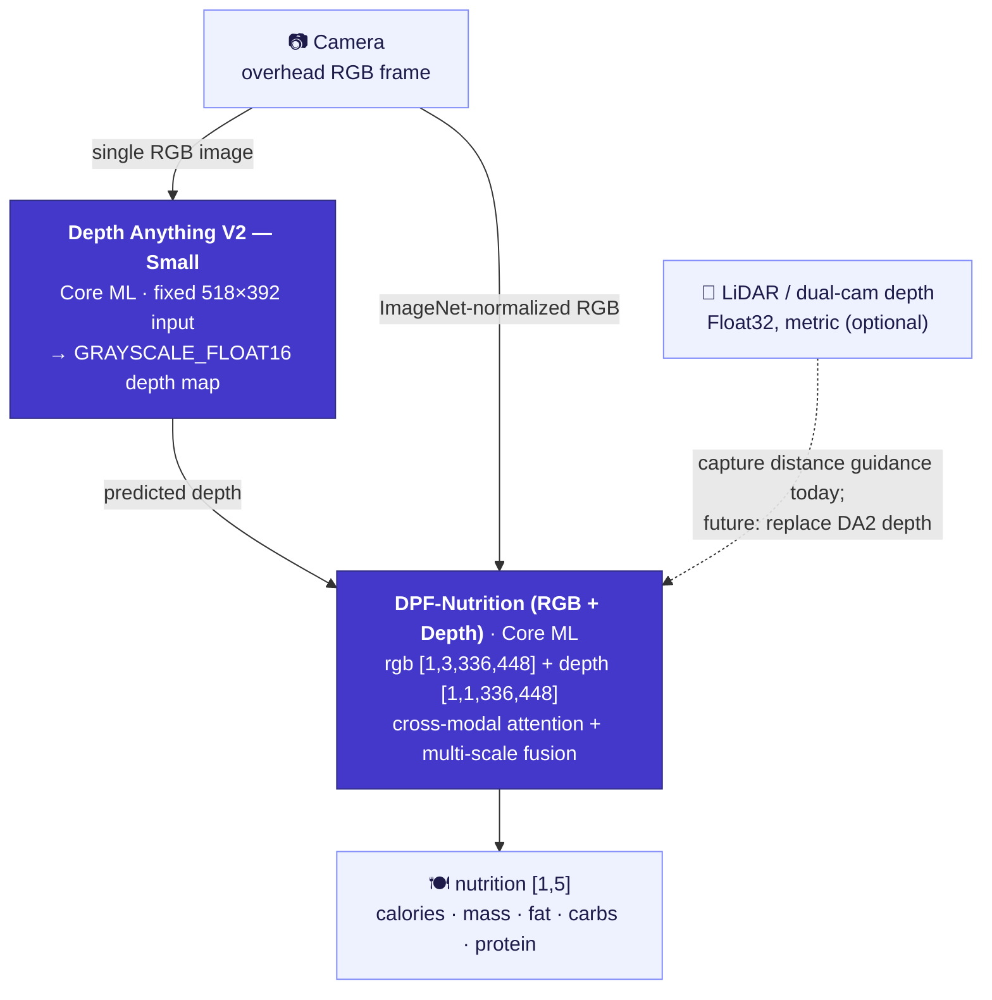

<div align="center">

[English](README.md) | [简体中文](README.zh-Hans.md) | **繁體中文** | [日本語](README.ja.md) | [한국어](README.ko.md) | [Español](README.es.md) | [Português (Brasil)](README.pt-BR.md) | [Français](README.fr.md) | [Deutsch](README.de.md)

# CalBro — iOS 裝置端食物熱量與營養追蹤

**一款原生 SwiftUI iPhone App，只要一張俯拍食物照片就能估算熱量與巨量營養素，全程在裝置端完成，採用 Depth-Anything-V2 → DPF-Nutrition 的 Core ML 流程。**

[](https://www.apple.com/ios/)
[](https://developer.apple.com/xcode/swiftui/)
[-5B5BD6)](https://developer.apple.com/documentation/coreml)
[](https://github.com/T0MYYY/nutrition5k-calorie-estimation)
[](https://huggingface.co/T0MYYY/dpf-nutrition)

</div>

> ⚠️ **研究原型，並非經過校準的產品。** 視覺骨幹網路**沒有**針對 iPhone 相機與感測器做過嚴謹校準。它產生的營養數值**不具任何參考價值**，不得用於醫療、飲食或臨床決策。詳見[限制](#限制)。

本專案是我們研究儲存庫 [**Nutrition5k — Vision-Based Food Calorie & Nutrition Estimation**](https://github.com/T0MYYY/nutrition5k-calorie-estimation) 的**應用 / 部署配套專案**。

> **CalBro 用的是哪個模型？** CalBro 內建的是 **[DPF-Nutrition](https://arxiv.org/abs/2310.11702)** 模型——*Depth Prediction and Fusion*（Han 等人，*Foods* 2023），**而非** CVPR 2021 的 *Nutrition5k* 架構。DPF-Nutrition 是「單眼 RGB → 預測深度 → RGB-D 融合」的迴歸模型，正好適合手機單張拍照的情境。我們的研究儲存庫同時重現了 CVPR 2021 的實驗*與* DPF-Nutrition；**CalBro 部署的是 DPF-Nutrition 這條路線。** 我們將訓練好的模型轉換為 Core ML，並放進一款完全離線執行、打磨完整的 iOS App。

---

## 螢幕截圖

| 初始設定 | 今天 | 營養 | 統計 |
|:---:|:---:|:---:|:---:|
|  |  |  |  |
| 依目標設定每日熱量 | 每日熱量圓環、巨量營養素圓環、餐點記錄、週檢視 | 目標、熱量來源、每餐明細 | 最近 7 天、趨勢與巨量營養素平均值 |

| 今天（深色） | 掃描結果 | 個人檔案（深色） | 體重預測 |
|:---:|:---:|:---:|:---:|
|  |  |  |  |
| 完整的淺色 / 深色主題 | 估算結果與份量調整（圖為模擬器範例） | 熱量預算、巨量營養素目標、每週摘要 | 依你的計畫推算達成日期 |

---

## 功能

- **掃描餐點。** 將手機垂直朝下對準餐盤。裝置端的引導系統（CoreMotion 傾角 + LiDAR / 深度測距）會提示角度與高度是否合適，對準後自動拍攝。
- **在裝置端估算營養。** 拍下的 RGB 畫面與深度圖會送進兩階段的 Core ML 流程，預測**熱量、重量、脂肪、碳水、蛋白質**——不需連網、不需帳號，資料不會離開手機。
- **絕不捏造數字。** 若照片或模型出了問題，App 會直接告訴你，且不會記錄任何內容——沒有備援估算值。
- **追蹤每一天。** 熱量圓環、巨量營養素圓環、可編輯的餐點記錄、月曆、每週統計、體重預測模擬器，以及具停滯期偵測的體重趨勢。
- **依你個人校準。** 累積兩週的量體重與餐點記錄後，CalBro 可以用根據你實際攝取量與體重變化推算出的維持熱量，取代 Mifflin-St Jeor 公式的估算值，並每兩週更新一次。
- **與系統整合。** Apple 健康（匯入身體數據與體重歷史、在每日預算中使用實測的活動能量、儲存已記錄的餐點）、本機通知提醒，以及透過 WidgetKit + App Group 提供的主畫面 / 鎖定畫面小工具。
- **多語系支援：** 英文、簡體中文、繁體中文、日文、韓文、西班牙文、巴西葡萄牙文、法文與德文，並支援公制與英制單位。

---

## 裝置端機器學習流程



- **第一階段：深度。** 轉換為 Core ML 的 [Depth Anything V2 Small](https://github.com/DepthAnything/Depth-Anything-V2) 從單張 RGB 畫面估算稠密深度圖（固定 **518×392** 輸入）。在配備 LiDAR 的 iPhone 上，硬體深度串流用來引導相機到合適的高度，目前尚未輸入給模型。
- **第二階段：營養。** 我們的 **DPF-Nutrition** RGB-D 迴歸模型（在[研究儲存庫](https://github.com/T0MYYY/nutrition5k-calorie-estimation)中訓練）以 ImageNet 正規化後的 RGB 與深度圖為輸入，迴歸出五項營養數值。
- 兩個模型都打包在 App 內，首次使用時編譯（30–60 秒），快取為 `.mlmodelc`，每次啟動只載入一次。開啟相機時就會開始載入。
- 預測結果為零或缺失時，會以錯誤回報，而不是顯示出來。

實作程式碼：`CalBro/Services/NutritionPredictionService.swift`、`ImagePreprocessing.swift`、`CameraCaptureController.swift`。

---

## 架構

- **SwiftUI + `@Observable` MVVM**，iOS 26，Swift 6 嚴格並行檢查，三個標籤頁（今天 / 統計 / 個人檔案）。相機是從「今天」頁 **+** 按鈕開啟的全螢幕模態畫面。
- **單一資料來源**：`ProfileStore`（個人檔案 + 體重記錄）與 `MealLogStore`（餐點 + 每日總計）由所有畫面直接觀察，任何修改都會立即反映到各處。
- **拍攝引導**（`CameraCaptureController`、`CameraFlowViewModel`）：選用 `.builtInLiDARDepthCamera` 取得真實深度；只有在俯拍傾角（< 28°）**且**高度落在 **27–34 cm** 區間時才會自動拍攝，距離以不帶單位的進度列顯示。手動快門隨時可用。
- **資料保存**：餐點（約 13 個月）、個人檔案、體重記錄與設定存放在 `UserDefaults`；當天的快照會同步到 **App Group**（`group.com.wydfcc.calbro`）供小工具使用。
- **WidgetKit**（`CalBroWidget/`）：主畫面（小 / 中）與鎖定畫面（圓形 / 矩形）小工具。App 內的預覽由同一個視圖（`Shared/NutritionWidgetFace.swift`）繪製。每次資料變動都會重新載入時間線，並在午夜自動換日。
- **HealthKit**（`HealthKitService`、`IntegrationViewModel`）：每一項都需使用者自行開啟——身體數據 + 體重歷史、活動能量（取代今日預算中依活動係數估算的額度），以及附帶同步識別碼寫入餐點的能量 / 巨量營養素，讓編輯與刪除保持同步。
- **本機通知**：在指定時間發送用餐提醒（當天已記錄就略過），以及達到目標 90 % 時每天一次的警示。
- **在地化**：App 與小工具共用 String Catalog（`Localizable.xcstrings`、`InfoPlist.xcstrings`）；日期、數字與單位皆使用系統格式器。
- **單位**：身高與體重可選公制或英制（初始設定與個人檔案中皆可設定）；熱量一律以千卡顯示。

```
CalBro/
├── Models/            UserProfile, LoggedMeal, nutrition & camera models
├── ViewModels/        Dashboard, CameraFlow, Calendar, Goals, Integration, …
├── Services/          CoreML pipeline, camera, HealthKit, reminders, meal store
├── Shared/            SharedNutrition.swift (App Group bridge, app + widget)
├── Views/             Today, Camera, Calendar, Stats, Goals, Integrations, …
├── DesignSystem/      CBColors / CBTypography / CBGlass / CBComponents
└── Resources/Models/  bundled Core ML packages (DA2 + DPF)
CalBroWidget/          WidgetKit extension
```

---

## 建置與執行

1. 將 Core ML 模型（檔案太大，未納入 git）放到 `CalBro/Resources/Models/`，詳見 [`MODELS.md`](CalBro/Resources/Models/MODELS.md)。缺少模型時，相機會提示模型尚未安裝。
2. Xcode 專案由 [XcodeGen](https://github.com/yonaskolb/XcodeGen) 依 `project.yml` 產生（`xcodegen generate`）；產生的專案也已一併提交。
3. 以 **Xcode 26+** 開啟 `CalBro.xcodeproj`，選擇 **CalBro** scheme。
4. 在 iOS 26 裝置上執行（建議使用具 LiDAR 的 iPhone Pro 以取得深度）。模擬器沒有相機，會回傳固定結果，並明確標示為*模擬器範例*。

```bash
# Simulator build
xcodebuild -project CalBro.xcodeproj -scheme CalBro \
  -destination 'platform=iOS Simulator,name=iPhone 17 Pro' -configuration Debug build

# Device build (automatic signing registers App Group + HealthKit + widget)
xcodebuild -project CalBro.xcodeproj -scheme CalBro \
  -destination 'generic/platform=iOS' -configuration Debug -allowProvisioningUpdates build
```

```bash
# Unit tests
xcodebuild -project CalBro.xcodeproj -scheme CalBro \
  -destination 'platform=iOS Simulator,name=iPhone 17 Pro' test
```

使用的功能（Capabilities）：**App Groups**、**HealthKit**、**Camera**、**User Notifications**、**WidgetKit**。

---

## 限制

**本 App 是學生專案，其營養輸出結果不可信。** 坦白說，限制如下：

- **骨幹網路未經嚴謹校準。** 視覺模型沒有針對 iPhone 相機內部參數校準，也沒有在裝置端以真實盛盤食物的真值資料校準過。**它產生的數值不具任何參考價值**——請把它當成 UI / 架構展示，而不是量測結果。
- **資料稀缺，本專案無法完成校準。** 要為手機拍攝情境校準深度 / 營養模型，需要大規模、針對特定裝置、經秤重取得真值的資料集。即使**每天記錄 4 餐、持續整整一年**，也只能得到**約 1,460 張照片**——遠遠不足以校準「感測器 + 模型」的流程，更別說**每款 iPhone（鏡頭、LiDAR、ISP）很可能都需要各自調適。**
- **單眼深度只是近似值。** Depth Anything V2 從單張 RGB 畫面估算的是相對深度，並非真實尺度，也沒有針對食物 / 份量的幾何形狀調校。
- **沒有食物資料庫，也沒有份量先驗。** 沒有後端、食物辨識資料庫或依食材的拆解——只有端到端迴歸模型輸出的五個數值。

> **請勿將 CalBro 用於醫療、飲食或臨床決策。** 它只是研究 / 工程原型。

---

## 未來工作

- **直接使用 iPhone 的 LiDAR 深度。** 硬體深度影格（`kCVPixelFormatType_DepthFloat32`，真實尺度，單位為公尺）很有潛力**完全取代單眼 Depth-Anything 階段**——App 已經在讀取它做距離引導。缺的是以真實 LiDAR 深度重新訓練 / 校準 DPF 所需的**資料蒐集**，而這在本專案中無法做到。
- **CLIP / VLM 融合。** 將 CLIP 類的圖文模型（食物類別先驗、開放詞彙辨識）與 RGB-D 迴歸模型融合，無論對準確度或依食材拆解，都是很有前景的方向。
- **依裝置校準，以及真正的真值資料集**（涵蓋多款 iPhone 的秤重餐點）。
- 食物命名（模型只預測營養成分，並不辨識是什麼料理）以及即時動態（Live Activities）。

---

## 與研究儲存庫的關係

CalBro 是 **[T0MYYY/nutrition5k-calorie-estimation](https://github.com/T0MYYY/nutrition5k-calorie-estimation)** 的部署路線——模型的訓練與 CVPR 2021 論文的重現都在該儲存庫完成。方法、指標與線上網頁展示請參見該儲存庫。

## 引用

CalBro 部署的是 **DPF-Nutrition** 模型。若你使用了本專案，請引用原始論文：

```bibtex
@article{han2023dpfnutrition,
  title   = {DPF-Nutrition: Food Nutrition Estimation via Depth Prediction and Fusion},
  author  = {Han, Yuzhe and Cheng, Qimin and Wu, Wenjin and Huang, Ziyang},
  journal = {Foods},
  volume  = {12},
  number  = {23},
  pages   = {4293},
  year    = {2023},
  doi     = {10.3390/foods12234293}
}
```

資料集與原始基準：

```bibtex
@inproceedings{thames2021nutrition5k,
  title     = {Nutrition5k: Towards Automatic Nutritional Understanding of Generic Food},
  author    = {Thames, Quin and Karpur, Arjun and Norris, Wade and Xia, Fangting and Panait, Liviu and Weyand, Tobias and Sim, Jack},
  booktitle = {CVPR},
  year      = {2021}
}
```

深度骨幹網路：[Depth Anything V2](https://github.com/DepthAnything/Depth-Anything-V2)（Yang 等人，2024）。

## 授權 / 免責聲明

採用 [MIT License](LICENSE) 授權。

研究 / 教學用途的原型。營養輸出結果**未經**驗證，不得作為健康決策的依據。
